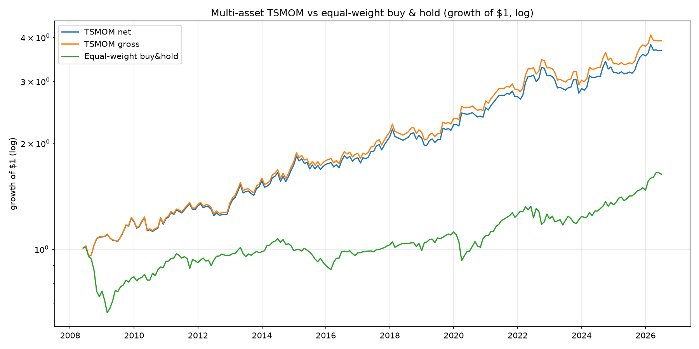
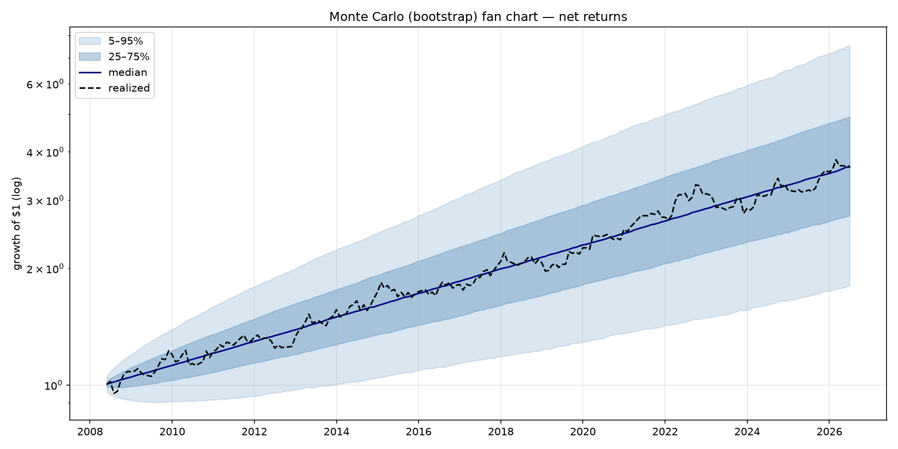
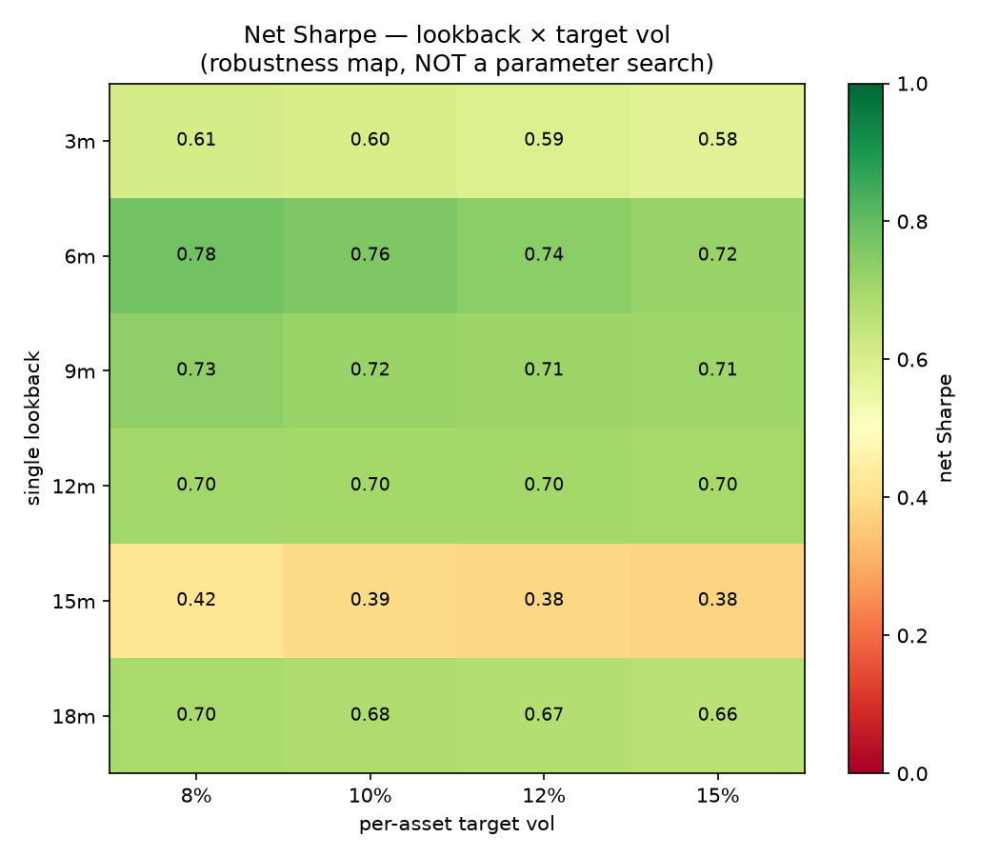

# Multi-Asset Time-Series Momentum — a falsification-oriented research study

**An institutional-style, end-to-end research study of a multi-asset time-series
momentum (TSMOM) strategy — built to *test* an edge honestly, not to sell one.**
17 ETFs across equities, bonds, commodities, FX and real estate; a five-step pipeline
(signal → volatility scaling → portfolio → risk control → validation); three control
experiments; strict no-look-ahead discipline with a unit-test suite.

## TL;DR

**What I built**
- An objectively-screened **17-asset universe** (30 → 17 by *independent risk factor*,
  using a daily-return correlation matrix + hierarchical clustering — not hand-picking).
- A full TSMOM pipeline with **no-look-ahead enforced and unit-tested** at every stage
  (truncation-invariance tests), realistic **transaction-cost modelling**, and
  institutional validation: **bootstrap confidence intervals, regime attribution,
  walk-forward, Monte-Carlo path risk, and a buy-&-hold benchmark**.
- **Three control experiments** to attack my own result: parameter robustness, cost
  sensitivity, and risk-parity-vs-equal-weight.
- **Anti-overfitting discipline throughout**: conventional parameters, *never* tuned on
  results; negative results reported as plainly as positive ones. **43 passing tests.**

**Honest conclusion**
- A **confirmable but modest edge**: net **Sharpe ≈ 0.70–0.75** (0.70 at a realistic
  ~5 bps cost), **95% bootstrap CI excludes 0** ([0.29, 1.23] @ 2 bps; [0.24, 1.18] @ 5 bps).
- **Strong crisis alpha** — +11.6% in the 2008 GFC and +7.3% in the 2020 COVID crash,
  while equal-weight buy & hold lost −27.4% and −13.0%.
- **But**: the CI is wide (lower bound ~0.29), the edge is **cost-sensitive** (marginal
  by 20 bps one-way), and Monte-Carlo shows a 20%+ drawdown is plausible (~45% of paths).
  Reported, not hidden.

## How this relates to my SMC projects

This is the third project in a deliberate research arc using **one honest validation
methodology**:

- **SMC / breakout on XAUUSD (single instrument)** — *falsified*: walk-forward + Monte
  Carlo showed the Sharpe CI crossing zero. No confirmable edge — a mathematical
  inevitability of low single-instrument signal-to-noise.
  *(repo: https://github.com/AaroNLaU0307/quant-backtest-framework)*
- **This project — multi-asset TSMOM** — *confirmed* a modest, cost-capped edge with
  genuine crisis alpha, by diversifying across independent factors to raise
  signal-to-noise.

Together they show the same rigor used to **both reject ineffective strategies and
confirm effective ones**. See [`STUDY_SUMMARY.md`](STUDY_SUMMARY.md) for the full
narrative.

## Engineering highlights

- **No-look-ahead by construction, and proven by tests.** Every layer has a
  *truncation-invariance* test: signals/weights/returns computed on a data prefix `[:t]`
  exactly equal the full-data values sliced at `t`. Positions are always the prior
  month-end's decision (`shift(1)`).
- **Transaction-cost model** (turnover × one-way bps) with a full cost-sensitivity sweep.
- **Institutional validation**: 10,000-sample bootstrap CIs, regime/crisis attribution,
  walk-forward sub-periods, 10,000-path Monte Carlo (shuffle + bootstrap), fan chart.
- **Config-driven, no magic numbers**; deterministic (fixed seeds); clean module
  separation. **43 unit tests** covering the fragile pieces.

## Strategy logic

Classic time-series (absolute) momentum: go **long** assets trending up, **short** assets
trending down, sized so each contributes roughly equal risk, then scale the whole book to
a target volatility.

- **Signal** (per asset, monthly): multi-period composite — mean of the signs of
  `{1, 3, 6, 12}`-month returns (continuous in [−1, +1]). Lookbacks are conventional and
  **never optimized**.
- **Per-asset sizing**: `weight = signal × target_vol / asset_vol` (60-day vol, 10%
  target), capped at ±2.0.
- **Aggregation**: equal-weight (a naive risk parity on vol-scaled positions).
- **Portfolio risk control**: scale to 10% portfolio vol (dynamic de-levering), gross
  capped at 3.0×.

**Universe (17):** SPY, EEM, EWJ, XLE, XLU · TLT, SHY, LQD, HYG · USO, UNG, GLD, DBA ·
UUP, FXY · VNQ, RWX. Common window **2007-04 → 2026-06**, covering the 2008 and 2020
crises. (Selection rationale and the 30→17 screening are in `STUDY_SUMMARY.md`.)

## Key results

Net of 2 bps, **2008-05 → 2026-06 (218 months)**:

| Metric | TSMOM | Equal-weight buy & hold |
| --- | --- | --- |
| Annualized return | 7.4% | 2.7% |
| Sharpe | **0.75**  *(CI [0.29, 1.23])* | 0.33 |
| Max drawdown | −15.6% | −34.8% |
| Calmar | 0.48 | 0.08 |

**TSMOM vs buy & hold** — note the smooth ride through 2008–09 (TSMOM was short risk):



**Monte-Carlo fan chart** (10,000 bootstrap paths; realized path tracks the median):



**Parameter robustness** — net Sharpe across the lookback × target-vol grid (a broad
green plateau, not a single hot spot; the default is *not* the peak):



## Control experiments (attacking my own result)

| Control | Finding |
| --- | --- |
| **Parameter robustness** | 45 combos: Sharpe [0.38, 0.87], **100% positive, 89% > 0.5**; default at the 71st percentile (not a cherry-picked peak). **Robust.** |
| **Cost sensitivity** | Survives to ~10 bps one-way (CI excludes 0); **marginal at 20 bps** (CI [−0.01, 0.92]). A turnover-cutting no-trade band *didn't help* — reported honestly. |
| **Risk parity vs equal-weight** | Equal-weight (0.70), inverse-vol (0.78), ERC (0.73) are **statistically indistinguishable** (within each other's CIs). **Simple equal-weight is the sound choice** — fewer parameters, lower turnover, no unstable covariance. |

## How to run (reproducible)

```powershell
python -m venv .venv
.\.venv\Scripts\Activate.ps1          # Windows;  source .venv/bin/activate on macOS/Linux
pip install -r requirements.txt

python run_analysis.py        # 30-ETF screening  -> output/ANALYSIS_REPORT.md
python finalize_universe.py   # lock the 17-asset universe, confirm window
python run_backtest.py        # returns + full validation -> output/BACKTEST_REPORT.md
python robustness.py          # parameter-sensitivity grid
python cost_analysis.py       # cost sensitivity + no-trade-band study
python rp_comparison.py       # risk-parity control
python -m pytest -q           # 43 tests (no-look-ahead + correctness)
```

The first run downloads daily ETF data from Yahoo Finance and caches it to `data/`;
later runs are instant. Outputs (CSVs, reports, figures) are written to `output/`.

## Project layout

```
config.py            # all parameters (no magic numbers) + paths
universe.py          # FINAL 17-asset universe + factor labels + exclusion reasons
run_analysis.py      # screening pipeline           run_backtest.py   # returns + validation
finalize_universe.py # window/diversification        robustness.py     # parameter grid
cost_analysis.py     # cost + turnover study         rp_comparison.py  # risk-parity control
src/
  fetch_data.py  data_quality.py  correlation.py  clustering.py  plots.py
  recommend.py   report.py  signals.py  sizing.py  portfolio.py  performance.py  validation.py
tests/   # screening + signal + sizing + portfolio + returns no-look-ahead tests
assets/  # key figures (tracked)        data/ output/  # git-ignored
STUDY_SUMMARY.md     # full research narrative
```

## Data

Daily **adjusted-close ETF data via [yfinance](https://github.com/ranaroussi/yfinance)**
(Yahoo Finance), `auto_adjust=True`. **Data is not committed** (licensing; `data/` is
git-ignored) — the loader fetches and caches it on first run. The 17 ETFs are liquid,
widely-available US-listed funds.

> ETFs are used as accessible proxies; a production TSMOM program would trade the
> underlying futures (no expense/roll drag, longer history). See limitations in
> `STUDY_SUMMARY.md`.

## Limitations & disclaimer

Honest limitations are detailed in [`STUDY_SUMMARY.md` §6](STUDY_SUMMARY.md): wide
confidence interval, cost sensitivity, Monte-Carlo tail risk (~45% chance of a 20%+
drawdown), post-2008 sample window, and ETF-vs-futures proxy bias.

**This project is for research and educational purposes only. It is not investment
advice. Backtested performance does not guarantee future results.**

---

*MIT License. © 2026 Aaron Lau Chiong Wen.*
