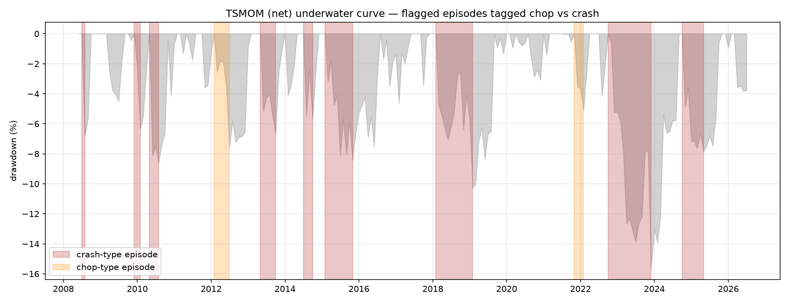

# Multi-Asset Time-Series Momentum — a research project

**An honest, end-to-end research arc around a multi-asset time-series momentum (TSMOM)
strategy: a *confirmed* core edge, then four candidate overlays each *falsified* at the
cheapest stage with a mechanism explanation.** The deliverable is not a single strategy —
it is the discipline: confirm what survives, reject what doesn't, and explain *why* in
each case.

> 17 ETFs across 5 sleeves · monthly TSMOM, vol-targeted · net Sharpe ≈ 0.75 (CI excludes
> zero) · a drawdown diagnostic · four falsified overlays · a parallel cross-sectional study (XSMOM)
> · 101 passing tests · strict
> no-look-ahead, reconciled at every step.

---

## 1. The confirmed core — multi-asset TSMOM

Classic time-series (absolute) momentum: go **long** assets trending up, **short** those
trending down, size each to equal risk, then scale the book to a target volatility.

- **Universe (17 ETFs, 5 sleeves):** Equity (SPY, EEM, EWJ, XLE, XLU) · Fixed income
  (TLT, SHY, LQD, HYG) · Commodity (USO, UNG, GLD, DBA) · FX (UUP, FXY) · Real estate
  (VNQ, RWX). Screened from 30 by *independent risk factor* (daily-return correlation +
  hierarchical clustering), not hand-picking. Common window **2007-04 → 2026-06**, covering
  the 2008 and 2020 crises.
- **Signal** (monthly, per asset): mean of the signs of `{1,3,6,12}`-month returns —
  continuous in [−1,+1]. Lookbacks are conventional and **never optimized**.
- **Sizing:** `weight = signal × target_vol / asset_vol` (60-day vol, 10% target, capped ±2).
- **Construction:** equal-weight aggregation (a naive risk parity), then scale the whole book
  to 10% portfolio vol, gross capped 3×.

**Result (net of 2 bps, 2008-05 → 2026-06, 218 months):**

| Metric | TSMOM (net) | Equal-weight buy & hold |
| --- | --- | --- |
| Annualized return | 7.4% | 2.7% |
| **Sharpe** | **0.75**  *(95% bootstrap CI [0.29, 1.23], excludes 0)* | 0.33 |
| Max drawdown | −15.6% | −34.8% |
| Crisis (GFC 2008 / COVID 2020) | **+11.6% / +7.3%** | −27.4% / −13.0% |

A **confirmable but modest** edge with genuine **crisis alpha** (momentum can go short;
buy & hold cannot). Honest caveats are kept, not hidden: the CI is wide (lower bound ~0.29),
the edge is cost-sensitive (marginal by ~20 bps one-way), and Monte-Carlo shows a 20%+
drawdown is plausible. Full core write-up: [`STUDY_SUMMARY.md`](STUDY_SUMMARY.md).

**Two honest design choices worth flagging** (both *cost* the headline number, deliberately):
- **Dropped CPER/WEAT/CORN** despite their diversification — their 2010–11 inceptions would
  have blocked the **2008 sample**, where TSMOM is most tested. Keeping the GFC mattered more.
- **Equal-weight over covariance optimization** — a 17×17 covariance is noisily estimated and
  spikes toward 1 in crises; equal-weight, inverse-vol, and ERC are statistically
  indistinguishable here, so the simplest, most robust choice wins (control experiment in
  [`rp_comparison.py`](rp_comparison.py)).


## 2. The methodology spine (used everywhere)

- **Anti-overfitting first.** Conventional parameters, never tuned on results. A clean
  **negative is a first-class outcome**, reported as plainly as a positive.
- **No look-ahead, proven by tests.** Every fragile primitive has a **truncation-invariance**
  test (recompute on a data prefix `[:t]` ⇒ identical values at `t`). Positions are always the
  prior period's decision (`shift(1)`).
- **Reuse + reconcile.** Each downstream study reuses the *exact* vol-scaled positions of the
  validated engine and **reconciles before attributing** (the diagnostic reconciles to
  3.5e-18; the daily infra compounds back to the monthly engine at 1.3e-15).
- **Full transaction-cost modelling**, with a cost-sensitivity sweep.
- **Premise before strategy.** An overlay must first be shown to *have a premise* (cheap,
  read-only) before any P&L is fit. All four overlays below were rejected at this gate.
- **Pre-registration + multiplicity control.** Calendar/seasonality is a multiple-comparisons
  minefield, so the seasonality study (3d) **pre-registered** its 18-test family and decision rule
  *before computing anything*, and corrected with **BH-FDR** across the whole family — the machinery
  actively caught a tempting false positive (below).
- **Falsification standard for any overlay** (demonstrated in the XSMOM study, §3·parallel): once a premise
  survives, a **paired-difference bootstrap** of Δ-Sharpe vs the core with **BH-FDR** across
  pre-registered variants. In practice all four overlays failed earlier, at the premise gate, so no
  P&L was ever fit.

**101 passing tests** cover the fragile pieces (signal/sizing/portfolio/returns no-look-ahead,
attribution reconciliation, daily↔monthly reconciliation, regime/premise causality, the
seasonality labellers/BH-FDR/HAC primitives, the causal yield-curve primitives, and the XSMOM
signal / dollar-neutral / decomposition primitives). Run `python -m pytest -q`.

## 3. The research arc — one diagnostic, four falsified overlays, one parallel study

Full write-ups in [`research/`](research/README.md). Summary:

### 3a. Drawdown diagnostic — *where does the core bleed?*
Decomposes the equity curve per asset/sleeve and classifies each drawdown as **chop**
(whipsaw) vs **crash** (a held trend reversing). Headline: drawdowns are **crash-type and
multi-sleeve**, and — the decision-relevant part — they occur in **ordinary-volatility,
low-correlation** regimes, *not* crises. (Honest caveat in the report: the position-conditional
split structurally leans "crash" for a slow trend-follower; the robust facts are the loss
*mechanism* and the multi-sleeve breadth.) This diagnosis is what gated the first two overlays (3b–3c).
→ [`research/diagnostic/`](research/diagnostic/DRAWDOWN_ATTRIBUTION_REPORT.md)



### 3b. Crash-defense overlay — **FALSIFIED at Phase 0**
- **Premise:** de-gross when systemic risk (cross-asset vol / correlation) spikes.
- **Gate (read-only):** verify the drawdowns are actually a systemic-risk-spike regime.
- **Why it failed — trigger anti-alignment.** Standalone (unit-risk) sleeves do fall together
  (~80%), but cross-sleeve correlation **does not spike** in drawdowns (+0.16 → +0.12). The
  causal systemic-risk signal is maxed (vol %ile 0.94–0.95) **in 2008/2020 — the strategy's
  biggest *profit* windows** — and only average (0.49) in the real drawdowns. A de-grossing
  trigger would therefore **amputate the crisis alpha and miss the actual drawdowns.** Clean no-go.
→ [`research/crash_defense/`](research/crash_defense/PHASE0_SYSTEMIC_VERIFICATION.md)

### 3c. Vol-compression breakout overlay — **FALSIFIED at Phase 1B**
- **Premise:** after volatility compresses, a directional breakout follows — and it sits in the
  ordinary-vol regime where the core bleeds, so it's orthogonal to the crash-defense failure.
- **Gate (descriptive):** does compression actually precede *directional* expansion, above base rate?
- **Why it failed — no directional premise.** Compression *is* followed by vol expansion (~1.3×,
  expected) but **not direction**: the post-move efficiency ratio is ≈ baseline (Δ ~0.00), and
  follow-through *quality* given a breakout improves only ~1pp on a 67% base (bonds/REITs
  flat-to-negative). The one large positive was a **mechanical narrow-channel artifact** (low vol
  ⇒ tight channel ⇒ more breakouts either way), and the effect **did not strengthen at tighter
  compression** — the signature of a real edge is absent.
- **Scope (data constraint):** this tests **close-to-close** compression only; the data is
  adjusted-close (no intraday H/L), so a true **intraday-ATR squeeze remains untested** (would
  need OHLC data) — stated, not glossed.
→ [`research/vol_breakout/`](research/vol_breakout/BREAKOUT_PHASE1B_PREMISE.md)

### 3d. Seasonality / calendar-effects overlay — **FALSIFIED at premise (0/18)**
- **Premise:** classic calendar anomalies — **turn-of-month**, **Halloween / "Sell-in-May"**, and the
  **Monday** effect — tilt daily returns, so a mechanical calendar tilt could complement the core. A
  different direction entirely from the drawdown-motivated overlays above.
- **Gate (descriptive, pre-registered).** Seasonality is the **highest-overfitting-risk** direction
  tested — calendar slicing has many dimensions, and *any* return series shows *some* "significant"
  pattern by chance — so the family and decision rule were **pre-registered before any computation**:
  3 a-priori effects × (pooled + 5 sleeves) = **18 cells**, each required to clear a **5-gate
  conjunction** — survive **BH-FDR q = 0.10** across the whole family **and** match the prior sign
  **and** clear a **≥ 5 bps/day** economic-magnitude bar **and** be **sub-period / year stable** **and**
  be **non-concentrated** (year-level jackknife for the annual effect).
- **Why it failed — nothing survives the multiplicity tax. 0 of 18 cells** clear the conjunction.
  Turn-of-month and Halloween are essentially **absent** here (Δ mostly 0–5 bps, p > 0.24).
- **The instructive near-miss — an *actively-caught false positive*.** The **Monday** effect had the
  **correct (negative) sign in all six scopes** and looked "significant" in isolation (Bond *p* = 0.026)
  — but the smallest raw *p* in the family (0.026) sits far above the BH rank-1 threshold (≈ 0.0056), so
  it **evaporates once the 18-test multiplicity tax is paid**. This is exactly the false positive the
  pre-registration + FDR existed to catch — *before* any modeling cost was spent. Flattening it to
  "Monday wasn't significant" would miss the point: in isolation it *was*; the discipline is what
  rejected it.
- **Mechanism cross-link.** The textbook **equity** turn-of-month premium is ~**+0.5 bps** here — it has
  essentially **arbitraged away at liquid-ETF granularity**, echoing the **XSMOM** finding (the parallel study below) that
  effects visible in large single-name universes dissipate at ETF granularity. Same mechanism family.
→ [`research/seasonality/`](research/seasonality/SEASONALITY_PHASE1_PREMISE.md) · pre-registration:
[`research/seasonality/PREREGISTRATION.md`](research/seasonality/PREREGISTRATION.md)

### 3e. Yield-curve slope overlay (macro regime) — **FALSIFIED at premise (0/6)**
- **Premise:** a single economy-wide **yield-curve slope** (10Y-3M primary, 10Y-2Y robustness) as a
  **portfolio-regime conditioner** on the whole book — the one *genuinely macro / orthogonal* overlay
  (the term structure of rates is not a function of the ETF price paths), unlike the three price-based ones.
- **Gate (descriptive, pre-registered).** A small **6-cell** family (2 spreads × 3 forward horizons
  {21, 63, 126}d × a causal trailing-percentile **tercile** state, conditioned at **t−1**), **BH-FDR
  q = 0.10** across all six, plus a **≥ 4%/yr** economic-magnitude bar and — the load-bearing gate — an
  **event-level leave-one-episode-out jackknife, ranked *above* the significance test**.
- **Why it failed — a nominal-sample-size illusion. 0 of 6 cells** confirm: nothing is significant
  (BH-FDR *p* 0.60–0.67; every bootstrap CI crosses 0), and the weak negative tilt is **carried entirely
  by the single 2022-24 inversion episode** — it collapses below the magnitude bar when that one episode
  is dropped (the larger 2017-20 flat stretch contributes ≈ 0). Reported as a **clean null with no
  claimable direction**: the H− "whipsaw-side" tilt is noise-level and jackknife-fragile — *not*
  "flatness predicts whipsaw".
- **Distinct pitfall vs the prior three.** The trap here is **nominal sample size, not statistical
  significance**: ~4,800 trading days, but the curve's inverted/flat state is effectively **one** macro
  episode (2022-24 = 97% of the 10Y-2Y inverted days), so any apparent effect is indistinguishable from a
  single-episode coincidence. The **episode jackknife** is what exposes it — a different
  statistical-pitfall dimension than the earlier overlays caught.
→ [`research/yield_spread/`](research/yield_spread/PHASE1_PREMISE.md) · pre-registration:
[`research/yield_spread/PREREGISTRATION.md`](research/yield_spread/PREREGISTRATION.md)

### Parallel investigation — Cross-sectional momentum (XSMOM) — **FALSIFIED (0/5)**
*Not an overlay on the core, but its **cross-sectional counterpart**: the same 17 ETFs and the same
engine, ranking assets against each other (dollar-neutral long-short) instead of each against its own
trend. The question — does relative-strength add anything time-series momentum doesn't?*
- **Phase 1 (head-to-head):** XSMOM net **Sharpe 0.28**, 95% CI [−0.18, 0.75] → **crosses 0**; and the
  punchline **`corr(XSMOM, TSMOM) = +0.42`** → the 50/50 mix (0.66) *dilutes* rather than diversifies
  (below TSMOM's 0.75). Part of the modest edge is a **static risk premium** (Sharpe halves under demeaning).
- **Phase 2 (5-universe, FDR-controlled map):** **0/5** universes survive BH-FDR + walk-forward +
  Deflated-Sharpe. The **Lo–MacKinlay decomposition** shows the XSMOM-only **lead-lag term is not shown
  to be non-trivial anywhere** — the mechanism: at liquid-ETF granularity, rank-relative and
  trend-absolute momentum are largely the **same source** the core already harvests.
→ [`research/xsmom/`](research/xsmom/XSMOM_README.md) (Phase 1) ·
[`research/xsmom/XSMOM_UNIVERSES_README.md`](research/xsmom/XSMOM_UNIVERSES_README.md) (Phase 2)

## 4. What this means

The confirmed-but-modest TSMOM core has **no obvious complementary overlay in the four
directions tested** — and establishing that, *with the mechanism of each failure*, is itself
the result. Crash-defense fails because the strategy's pain is not a contagion regime;
vol-compression breakout fails because close-to-close compression carries no directional
information here; seasonality fails because the textbook calendar effects have essentially
arbitraged away at liquid-ETF granularity; and the yield-curve slope — the one genuinely macro,
orthogonal direction — fails because its apparent regime effect is a **nominal-sample-size illusion**,
carried entirely by the single 2022-24 inversion episode and gone under a leave-one-episode-out
jackknife. All four were rejected before any curve-fitting, at the cheapest possible stage; a broader
macro-regime overlay was then **pre-emptively closed at the event-count level** for the same sparsity
reason, rather than spend the test budget reproducing a foregone conclusion. That is the point of the
project: the same honest validation machinery that **confirms** a real edge also **rejects**
plausible-sounding additions — and along the way caught two *different* statistical illusions the
discipline exists to catch: a tempting **false positive** (seasonality's Monday, dissolved by the
pre-registered multiplicity correction) and a **nominal-sample-size illusion** (yield-spread's
single-episode effect, dissolved by the episode jackknife) — both before a dollar of P&L was fit. And
the **cross-sectional counterpart (XSMOM)** — not an overlay, but the same core seen through
relative-strength instead of trend — was *also* falsified (0/5 universes), for the most telling reason
of all: at liquid-ETF granularity it is largely the **same source** the time-series core already
harvests (corr +0.42; the XSMOM-only lead-lag term not shown to be non-trivial).

## How to run (reproducible)

```powershell
python -m venv .venv ; .\.venv\Scripts\Activate.ps1 ; pip install -r requirements.txt

# --- confirmed core ---
python run_analysis.py            # 30-ETF screening
python finalize_universe.py       # lock the 17-asset universe
python run_backtest.py            # returns + full validation
python robustness.py ; python cost_analysis.py ; python rp_comparison.py   # control experiments

# --- research arc ---
python run_drawdown_attribution.py        # diagnostic
python verify_systemic.py                 # crash-defense Phase 0 (falsified)
python run_breakout_phase1a.py            # daily infra
python run_breakout_phase1b.py            # vol-breakout premise (falsified)
python run_seasonality_premise.py         # seasonality premise, 0/18 (falsified)
python run_yield_premise.py               # yield-curve slope premise, 0/6 (falsified)

# --- parallel: cross-sectional momentum (XSMOM) ---
python run_xsmom.py                        # XSMOM Phase 1 head-to-head, Sharpe 0.28 (falsified)
python run_xsmom_universes.py             # XSMOM Phase 2 map, 0/5 (falsified)

python -m pytest -q                       # 101 tests
```

First core run downloads daily ETF data from Yahoo Finance and caches it to `data/`
(git-ignored); later runs are instant. Reports/figures/CSVs write to `output/` (git-ignored,
regenerable); the committed arc write-ups live in [`research/`](research/README.md).

## Project layout

```
config.py  universe.py            # parameters (no magic numbers) + the locked 17-asset universe
run_*.py  verify_systemic.py      # entry points: core backtest, controls, diagnostic, overlays
check_*.py  export_signals.py     # core-TSMOM sanity / spot-check utilities
src/                              # library: engine + screening + diagnostic + daily/premise infra
  signals sizing portfolio performance validation fetch_data plots      # core engine
  correlation clustering data_quality recommend report                  # universe screening
  attribution regime                                                    # drawdown diagnostic
  daily premise                                                         # vol-breakout infra + premise
  seasonality                                                           # calendar-effects premise (BH-FDR + HAC)
  yields                                                                # yield-curve macro-regime premise (causal slope/tercile)
  xsmom xsmom_data xsmom_stats                                          # cross-sectional momentum (parallel study)
research/                         # committed arc write-ups (reports + figures), per investigation
tests/                           # 101 tests (no-look-ahead + reconciliation + causality)
assets/                          # tracked key figures   ·   data/ output/  (git-ignored)
STUDY_SUMMARY.md                 # full core-TSMOM research narrative
```

## Limitations & disclaimer

Honest limitations are detailed in [`STUDY_SUMMARY.md`](STUDY_SUMMARY.md): wide confidence
interval, cost sensitivity, Monte-Carlo tail risk, post-2008 sample window, and ETF-vs-futures
proxy bias. The vol-breakout negative is scoped to close-to-close compression (no intraday ATR);
the seasonality negative is scoped to the three pre-registered calendar effects on this 17-ETF
universe (not a claim that no calendar structure exists in any market).

**For research and educational purposes only. Not investment advice. Backtested performance
does not guarantee future results.**

---

*MIT License. © 2026 Aaron Lau Chiong Wen.*
