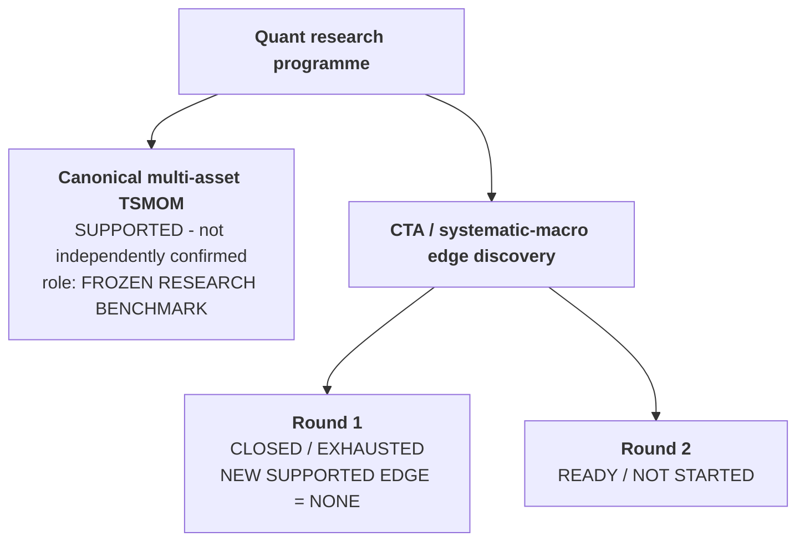
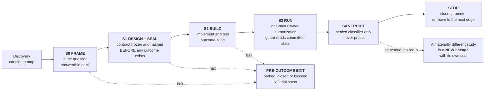
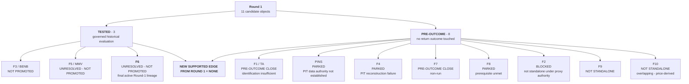
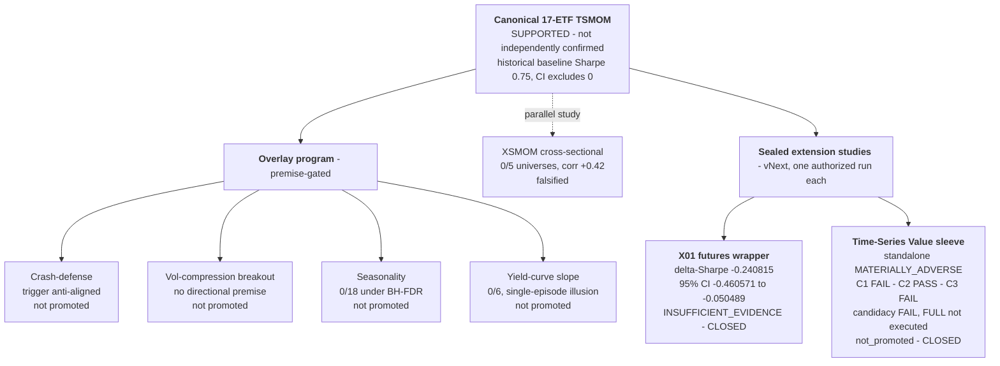
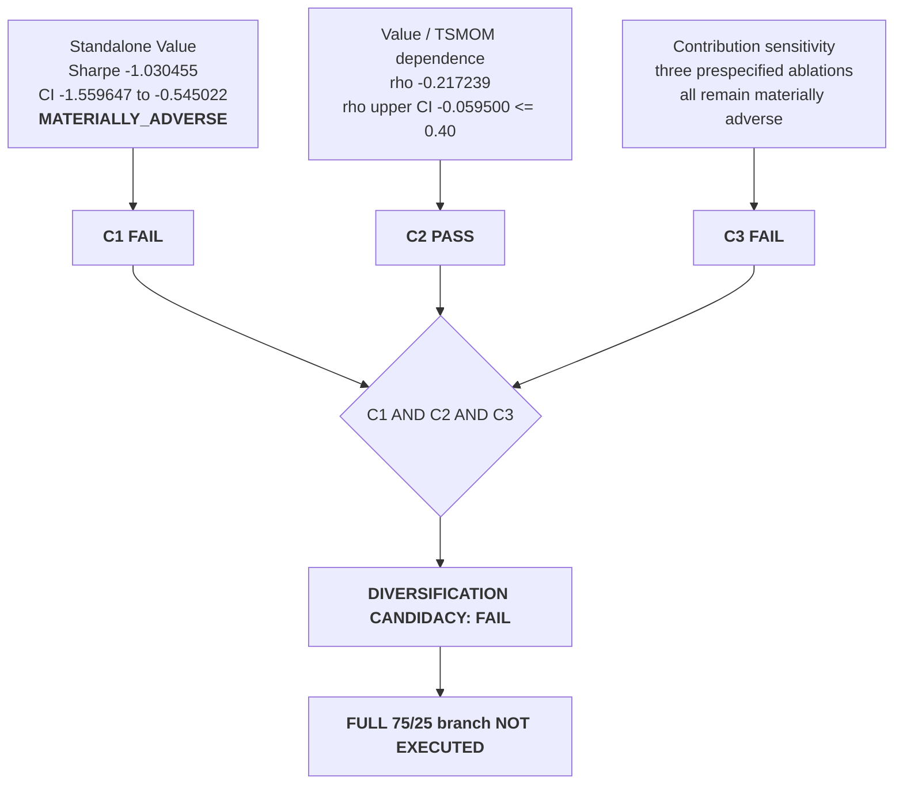

# Multi-Asset Time-Series Momentum — a research project


> **Workflow (cutover 2026-09-12).** This project runs under
> `../QUANT_WORKFLOW_VNEXT.md` — workspace-local workflow authority, **not published
> in this repository** —
> `S0 FRAME → S1 DESIGN+SEAL → S2 BUILD → S3 RUN → S4 VERDICT → STOP`.
> Current **state** — never workflow authority — lives in
> [`PROJECT_STATE.md`](PROJECT_STATE.md). Read that first.
>
> **Sealed research contracts stay authoritative** and may be stricter than
> vNext where that is part of the research design — for X01 that is
> [`research/extensions/x01/X01_PREREGISTRATION_DRAFT.md`](research/extensions/x01/X01_PREREGISTRATION_DRAFT.md),
> sealed 2026-09-13 despite the historical `_DRAFT` filename.
>
> **The QROS / L6 material is history, not the default route.** The A–L stage
> chain, `qros next` routing, Review Packets, standing reviewer seats,
> review-of-review and closure/residual-verification packages are retired;
> documents here that still use that vocabulary are provenance records, not
> current instructions. `qros check` / `qros status` survive as **on-demand**
> mechanical diagnostics, and a `qros` HOLD is information, not a gate.

## Current state


```mermaid
flowchart TD
    P["<b>Quant research programme</b>"]

    P --> BM["<b>Canonical multi-asset TSMOM</b><br/>SUPPORTED - not independently confirmed<br/>role: FROZEN RESEARCH BENCHMARK"]
    P --> DISC["<b>CTA / systematic-macro edge discovery</b>"]

    DISC --> R1["<b>Round 1</b><br/>CLOSED / EXHAUSTED<br/>NEW SUPPORTED EDGE = NONE"]
    DISC --> R2["<b>Round 2</b><br/>READY / NOT STARTED"]
```

| | |
|---|---|
| Canonical TSMOM | **SUPPORTED — NOT INDEPENDENTLY CONFIRMED** · role: **frozen research benchmark** |
| CTA / systematic-macro Discovery **Round 1** | **CLOSED / EXHAUSTED** — [`ROUND1_CLOSEOUT.md`](ROUND1_CLOSEOUT.md) |
| New supported edge from Round 1 | **NONE** |
| Latest completed candidate | **CTA-EDGE-05 / F6** — scheduled macro announcement premium |
| F6 terminal state | **CLOSED_UNRESOLVED_NOT_PROMOTED** — both nominal 95% intervals span zero |
| F6 — falsified? | **NO.** Not falsified, not evidence of absence, not low power |
| Governed historical evaluations in Round 1 | **3** (BENB, MMV, F6) — 8 of 11 candidate objects reached a terminal pre-outcome disposition: closed, parked, blocked or ruled not standalone |
| Live execution authorizations | **NONE** — every grant is one-shot and spent |
| **Round 2** | **READY / AUTHORIZED — NOT STARTED** |
| Programme next | Round-2 discovery, not yet begun |

---

[](https://github.com/AaroNLaU0307/multi-asset-tsmom-research/actions/workflows/tests.yml)

**An honest, end-to-end research arc around a multi-asset time-series momentum (TSMOM)
strategy: a *supported* core edge, then four candidate overlays each rejected at the
cheapest stage with a mechanism explanation, and two later sealed extension studies that
were run to a preregistered verdict and closed.** The deliverable is not a single strategy —
it is the discipline: keep what survives, reject what doesn't, and explain *why* in
each case.

> 17 ETFs across 5 sleeves · monthly TSMOM, vol-targeted · net Sharpe ≈ 0.75 (CI excludes
> zero) · a drawdown diagnostic · four overlays not promoted · a parallel cross-sectional study (XSMOM, falsified)
> · a CI-verified test suite · strict
> no-look-ahead, reconciled at every step.

## TL;DR (60 seconds)

- **Supported core** (*not* independently confirmed): multi-asset TSMOM, 17 ETFs / 5 sleeves,
  monthly + vol-targeted — historical-baseline net Sharpe **0.75** (95% bootstrap CI [0.29, 1.23],
  excludes 0), with genuine crisis alpha (GFC +11.6%, COVID +7.3%).
- **Four overlays tested to extend it, none promoted — each rejected at the cheapest premise stage** —
  crash-defense (trigger anti-aligned with drawdowns), vol-compression breakout (no directional
  premise), seasonality (0/18, BH-FDR multiplicity), yield-curve macro regime (0/6, single-episode
  illusion) — each with a stated mechanism, not just "it didn't work."
- **A parallel cross-sectional study (XSMOM)** — also falsified: Sharpe 0.28 (CI crosses 0),
  +0.42-correlated with TSMOM (no diversification), 0/5 universes in the FDR-controlled map.
- **Methodology, not just numbers:** pre-registration before any result, BH-FDR multiplicity
  control, no-look-ahead *proven* by truncation-invariance tests — not asserted.
- **CI-verified test suite** run on every push (badge above) — not a self-reported count.
  It is **not currently all-green**: `python -m pytest -q` reports **98 passed, 3 failed**.
  The three failures are pre-existing `OutOfBoundsDatetime` fixture failures in
  `tests/test_xsmom_universes.py`, unrelated to any research verdict and reproducible at
  earlier commits. See [Validation status](#how-to-run-reproducible) for the full picture.
- **Three sealed extension studies, all closed under preregistration** — the X01
  futures-wrapper study (`INSUFFICIENT_EVIDENCE`), the Time-Series Value sleeve (standalone
  `MATERIALLY_ADVERSE`, diversification candidacy failed, `not_promoted`) and TSMOM-VRP-01
  (short VIX futures, `UNRESOLVED`). Each ran exactly one authorized execution against a
  sealed contract.
- **A third sealed study, TSMOM-VRP-01 (short VIX futures), closed `UNRESOLVED`** — the 95%
  interval contains the preregistered +7.5% margin, so the study neither establishes that the
  sleeve clears the required compensation nor reliably excludes it. Its exploratory 80/20
  portfolio diagnostic is **`NOT_COMPELLING`**: see §4c.
- **Costs always modelled; negatives are first-class results**, reported as plainly as the one positive.

## Programme roadmap

| Phase | What it was | Status |
|---|---|---|
| **A** | research / status cleanup | **COMPLETE** |
| **B** | canonical TSMOM validation | see below |
| **C** | next-edge discovery and adjudication | **COMPLETE** |
| **D** | TSMOM-VRP-01 — the selected candidate, run to a verdict | **COMPLETE / CLOSED** |
| **E** | **CTA / systematic-macro Discovery Round 1** — 11 candidate objects triaged, 8 pre-outcome dispositions, 3 governed historical evaluations | **COMPLETE / CLOSED / EXHAUSTED** — **0 new supported edges** |
| **F** | **Discovery Round 2** | **READY / AUTHORIZED — NOT STARTED** |

**Phase E — Round 1, in one line.** Eleven candidate objects were triaged; **eight**
closed, parked, were blocked or were ruled non-standalone **before** any return outcome
was touched; **three** proceeded to governed historical evaluation and **none was
promoted**. Full dispositions: [`ROUND1_CLOSEOUT.md`](ROUND1_CLOSEOUT.md).

### The lifecycle every candidate runs


```mermaid
flowchart LR
    D["Discovery<br/>candidate map"] --> S0["<b>S0 FRAME</b><br/>is the question<br/>answerable at all"]
    S0 --> S1["<b>S1 DESIGN + SEAL</b><br/>contract frozen and hashed<br/>BEFORE any outcome exists"]
    S1 --> S2["<b>S2 BUILD</b><br/>implement and test<br/>outcome-blind"]
    S2 --> S3["<b>S3 RUN</b><br/>one-shot Owner authorization<br/>guard reads committed state"]
    S3 --> S4["<b>S4 VERDICT</b><br/>sealed classifier only<br/>never prose"]
    S4 --> STOP["<b>STOP</b><br/>close, promote,<br/>or move to the next edge"]

    S0 -. halt .-> PRE["<b>PRE-OUTCOME EXIT</b><br/>parked, closed or blocked<br/>NO trial spent"]
    S1 -. halt .-> PRE
    S2 -. halt .-> PRE

    S4 -. no rescue, no rerun .-> NEWLIN["A materially different study<br/>is a <b>NEW lineage</b><br/>with its own seal"]
```

Progression is one-way. The contract is sealed before any outcome exists, a real run needs
a separate one-shot authorization, and the terminal class comes from the sealed classifier.
**There is no post-result rescue inside the same primary lineage** — a consumed primary
trial stays consumed.

### Round 1 at a glance


```mermaid
flowchart TD
    R1["<b>Round 1</b><br/>11 candidate objects"]

    R1 --> TESTED["<b>TESTED</b> - 3<br/>governed historical evaluation"]
    R1 --> PREOUT["<b>PRE-OUTCOME</b> - 8<br/>no return outcome touched"]

    TESTED --> T1["F3 / BENB<br/>NOT PROMOTED"]
    TESTED --> T2["F5 / MMV<br/>UNRESOLVED - NOT PROMOTED"]
    TESTED --> T3["<b>F6</b><br/>UNRESOLVED - NOT PROMOTED<br/>final active Round-1 lineage"]

    PREOUT --> P1["F1 / TA<br/>PRE-OUTCOME CLOSE<br/>identification insufficient"]
    PREOUT --> P2["PINS<br/>PARKED<br/>PIT data authority not established"]
    PREOUT --> P3["F4<br/>PARKED<br/>PIT reconstruction failure"]
    PREOUT --> P4["F7<br/>PRE-OUTCOME CLOSE<br/>non-run"]
    PREOUT --> P5["F8<br/>PARKED<br/>prerequisite unmet"]
    PREOUT --> P6["F2<br/>BLOCKED<br/>not standalone under proxy authority"]
    PREOUT --> P7["F9<br/>NOT STANDALONE"]
    PREOUT --> P8["F10<br/>NOT STANDALONE<br/>overlapping - price-derived"]

    TESTED --> OUT["<b>NEW SUPPORTED EDGE FROM ROUND 1 = NONE</b>"]
    PREOUT --> OUT
```

Eight of eleven were resolved without spending a return trial at all — that is the S0 gate
working, not a shortfall. Per-candidate reasoning and the artifact that decides each one:
[`ROUND1_CLOSEOUT.md`](ROUND1_CLOSEOUT.md).

**Phase B — canonical TSMOM validation.** The core remains **`SUPPORTED — NOT
INDEPENDENTLY CONFIRMED`**. Its prospective confirmation study (**C-A**) is sealed and
**live under passive monthly accrual** in its existing state; nothing here touches it. The
independent verification study (**C-D**) is **closed at HOLD** with strong evidence and one
unresolved cross-vendor residual.

**Phase C — next-edge discovery.** Claude Fable 5.1 and GPT-6 Astra were used for candidate
discovery and adversarial challenge; neither may later certify what it helped design. The
selected question was whether an **unconditional one-month constant-maturity short VX
futures sleeve earns enough compensation for its severe short-volatility risk**. A
**Treasury auction / intermediation** candidate was identified as a reserve and is **not**
started here.

## Where things live

One authority per question — these do not compete:

| you want | go to | kind |
|---|---|---|
| the workflow rules | `../QUANT_WORKFLOW_VNEXT.md` *(workspace-local; not published in this repository)* | **authority** |
| current project state | [`PROJECT_STATE.md`](PROJECT_STATE.md) | **state** — never workflow authority |
| Round-1 dispositions | [`ROUND1_CLOSEOUT.md`](ROUND1_CLOSEOUT.md) | derived summary |
| the canonical TSMOM study | [`STUDY_SUMMARY.md`](STUDY_SUMMARY.md) · §1 below | narrative |
| why a design choice was made | [`DESIGN_DECISIONS.md`](DESIGN_DECISIONS.md) | record |
| a specific lineage | `research/extensions/<lineage>/` | artifacts |
| Owner decisions | [`ops/`](ops/) — `OWNER_DECISION_RECORD_*.md` | **authority** |
| who may run what | [`ops/EXECUTION_AUTHORIZATIONS.md`](ops/EXECUTION_AUTHORIZATIONS.md) | **authority**, append-only |
| trial accounting | [`research/extensions/TRIAL_LEDGER.md`](research/extensions/TRIAL_LEDGER.md) | append-only ledger |
| what outcomes have been seen | [`ops/EXPOSURE_LEDGER.md`](ops/EXPOSURE_LEDGER.md) | append-only ledger |
| sample reuse / evidence ceilings | [`research/extensions/SAMPLE_REUSE.md`](research/extensions/SAMPLE_REUSE.md) | **authority** |
| independent reviews | [`research/extensions/review_history/`](research/extensions/review_history/) | reviews |

### How provenance works here

```
SEAL       a preregistration is frozen and hashed BEFORE any outcome exists;
           the seal record pins the contract, the event sample and the inputs
AUTHORIZE  a real run needs a ONE_SHOT Owner record committed to
           ops/EXECUTION_AUTHORIZATIONS.md. A seal is NOT authorization.
RUN        the guard reads that ledger from COMMITTED git state and fails
           closed; one grant authorizes exactly one run_id, once
ACCOUNT     the consumed trial lands in TRIAL_LEDGER.md and the revealed
           outcome in EXPOSURE_LEDGER.md, both append-only
VERDICT     the terminal class comes from the sealed classifier, not from prose
```

Every lineage folder carries its own `S0 → S1 → S2 → S3 → S4` artifacts under that
pattern. Where an older document and a newer one disagree, the newer one names the older
as superseded — nothing is deleted or rewritten to make the record look tidier.

---

## The research map


```mermaid
flowchart TD
    CORE["<b>Canonical 17-ETF TSMOM</b><br/>SUPPORTED - not independently confirmed<br/>historical baseline Sharpe 0.75, CI excludes 0"]

    CORE --> OV["<b>Overlay program</b> - premise-gated"]
    OV --> O1["Crash-defense<br/>trigger anti-aligned<br/>not promoted"]
    OV --> O2["Vol-compression breakout<br/>no directional premise<br/>not promoted"]
    OV --> O3["Seasonality<br/>0/18 under BH-FDR<br/>not promoted"]
    OV --> O4["Yield-curve slope<br/>0/6, single-episode illusion<br/>not promoted"]

    CORE -. parallel study .-> X["XSMOM cross-sectional<br/>0/5 universes, corr +0.42<br/>falsified"]

    CORE --> EXT["<b>Sealed extension studies</b> - vNext, one authorized run each"]
    EXT --> X01["<b>X01 futures wrapper</b><br/>delta-Sharpe -0.240815<br/>95% CI -0.460571 to -0.050489<br/>INSUFFICIENT_EVIDENCE - CLOSED"]
    EXT --> VAL["<b>Time-Series Value sleeve</b><br/>standalone MATERIALLY_ADVERSE<br/>C1 FAIL - C2 PASS - C3 FAIL<br/>candidacy FAIL, FULL not executed<br/>not_promoted - CLOSED"]
```

| Line of work | Status | Where the evidence lives |
| --- | --- | --- |
| Canonical 17-ETF TSMOM core | **supported** — not independently confirmed | [`STUDY_SUMMARY.md`](STUDY_SUMMARY.md) |
| Four overlays (crash-defense, vol-breakout, seasonality, yield-curve) | **not promoted** — all rejected at the premise gate | [`research/`](research/README.md) |
| XSMOM cross-sectional (parallel) | **falsified** — 0/5 universes under a FDR-controlled replication map | [`research/xsmom/`](research/xsmom/XSMOM_README.md) |
| X01 futures wrapper (sealed) | **INSUFFICIENT_EVIDENCE** — closed | [`research/extensions/x01/`](research/extensions/x01/) |
| Time-Series Value sleeve (sealed) | **not_promoted** — closed | [`research/extensions/value/`](research/extensions/value/) |

Status words above are the knowledge base's own vocabulary, and the registry is the
authoritative source. Two labels are deliberately different: the four overlays are
`not_promoted` — each failed a single cheap premise gate before any P&L was fit — while
XSMOM is `falsified`, having been rejected across a five-universe FDR-controlled
replication with nothing material left untried. The narrative sections below use
"falsification" to describe the *method*; the status words are what the registry records.

---

## 1. The supported core — multi-asset TSMOM

> **Status: `supported`, not independently confirmed.** No held-out out-of-sample
> confirmation has been run; parameters were never fitted. The numbers below are the
> **historical baseline** result on the window stated in the table, and are *not*
> comparable to the later sealed extension studies, which use their own windows.

Classic time-series (absolute) momentum: go **long** assets trending up, **short** those
trending down, size each to equal risk, then scale the book to a target volatility.

- **Universe (17 ETFs, 5 sleeves):** Equity (SPY, EEM, EWJ, XLE, XLU) · Fixed income
  (TLT, SHY, LQD, HYG) · Commodity (USO, UNG, GLD, DBA) · FX (UUP, FXY) · Real estate
  (VNQ, RWX). Screened from 30 by *independent risk factor* (daily-return correlation +
  hierarchical clustering), not hand-picking. Common window **2007-04 → 2026-06**, covering
  the 2008 and 2020 crises.
- **Signal** (monthly, per asset): mean of the signs of `{1,3,6,12}`-month returns —
  continuous in [−1,+1]. Lookbacks are conventional and **never optimized**.
- **Sizing:** `weight = signal × target_vol / asset_vol` (60-day vol, 10% target, capped ±2).
- **Construction:** equal-weight aggregation (a naive risk parity), then scale the whole book
  to 10% portfolio vol, gross capped 3×.

**Historical baseline result (net of 2 bps, 2008-05 → 2026-06, 218 months):**

| Metric | TSMOM (net) | Equal-weight buy & hold |
| --- | --- | --- |
| Annualized return | 7.4% | 2.7% |
| **Sharpe** | **0.75**  *(95% bootstrap CI [0.29, 1.23], excludes 0)* | 0.33 |
| Max drawdown | −15.6% | −34.8% |
| Crisis (GFC 2008 / COVID 2020) | **+11.6% / +7.3%** | −27.4% / −13.0% |

A **supported but modest** edge with genuine **crisis alpha** (momentum can go short;
buy & hold cannot). Honest caveats are kept, not hidden: the CI is wide (lower bound ~0.29),
the edge is cost-sensitive (marginal by ~20 bps one-way), and Monte-Carlo shows a 20%+
drawdown is plausible. Full core write-up: [`STUDY_SUMMARY.md`](STUDY_SUMMARY.md).

**Two honest design choices worth flagging** (both *cost* the headline number, deliberately):
- **Dropped CPER/WEAT/CORN** despite their diversification — their 2010–11 inceptions would
  have blocked the **2008 sample**, where TSMOM is most tested. Keeping the GFC mattered more.
- **Equal-weight over covariance optimization** — a 17×17 covariance is noisily estimated and
  spikes toward 1 in crises; equal-weight, inverse-vol, and ERC are statistically
  indistinguishable here, so the simplest, most robust choice wins (control experiment in
  [`rp_comparison.py`](rp_comparison.py)).


## 2. The methodology spine (used everywhere)

- **Anti-overfitting first.** Conventional parameters, never tuned on results. A clean
  **negative is a first-class outcome**, reported as plainly as a positive.
- **No look-ahead, proven by tests.** Every fragile primitive has a **truncation-invariance**
  test (recompute on a data prefix `[:t]` ⇒ identical values at `t`). Positions are always the
  prior period's decision (`shift(1)`).
- **Reuse + reconcile.** Each downstream study reuses the *exact* vol-scaled positions of the
  validated engine and **reconciles before attributing** (the diagnostic reconciles to
  3.5e-18; the daily infra compounds back to the monthly engine at 1.3e-15).
- **Full transaction-cost modelling**, with a cost-sensitivity sweep.
- **Premise before strategy.** An overlay must first be shown to *have a premise* (cheap,
  read-only) before any P&L is fit. All four overlays below were rejected at this gate.
- **Pre-registration + multiplicity control.** Calendar/seasonality is a multiple-comparisons
  minefield, so the seasonality study (3d) **pre-registered** its 18-test family and decision rule
  *before computing anything*, and corrected with **BH-FDR** across the whole family — the machinery
  actively caught a tempting false positive (below).
- **Falsification standard for any overlay** (demonstrated in the XSMOM study, §3·parallel): once a premise
  survives, a **paired-difference bootstrap** of Δ-Sharpe vs the core with **BH-FDR** across
  pre-registered variants. In practice all four overlays failed earlier, at the premise gate, so no
  P&L was ever fit.

**The test suite** covers the fragile pieces (signal/sizing/portfolio/returns no-look-ahead,
attribution reconciliation, daily↔monthly reconciliation, regime/premise causality, the
seasonality labellers/BH-FDR/HAC primitives, the causal yield-curve primitives, and the XSMOM
signal / dollar-neutral / decomposition primitives). Run `python -m pytest -q`.

**Validation status — not all-green, stated plainly.** `python -m pytest -q` reports
**98 passed, 3 failed** (verified on this branch, pandas 2.3.3, Python 3.13.14). The three
failures are **pre-existing and unrelated to any research verdict**: `OutOfBoundsDatetime`
on synthetic fixture dates in `tests/test_xsmom_universes.py`, reproducible identically at
earlier commits. The checks belonging to the closed Time-Series Value and TSMOM-VRP-01
lineages pass, as do the sealed-contract conformance, data provenance and synthetic
end-to-end rehearsal suites.

The CTA-EDGE-05 / F6 lifecycle suite is **not** collected by the default pytest patterns
and is run explicitly: `python -m pytest research/extensions/f6/f6_tests.py` reports
**113 passed, 1 failed**. That one failure is expected and correct —
`test_o02_no_f6_result_artifact_exists_in_the_repository` asserts an S2-era precondition
that is *false* now the authorized S3 run has produced a result. `f6_tests.py` is
hash-pinned in the accepted S2 build manifest and was deliberately not edited.

*History, no longer current:* three tests in `tests/test_xsmom_universes.py` **previously**
failed under an earlier pandas API-drift environment — a library-compatibility issue, never
a research finding, reproducing unchanged at commit `c63114a0` and predating the Value work.
That file now passes 16/16. XSMOM's recorded status (`falsified`) always rested on its
published results, not on these tests.

## 3. The research arc — one diagnostic, four overlays not promoted, one parallel study

Full write-ups in [`research/`](research/README.md). Summary:

### 3a. Drawdown diagnostic — *where does the core bleed?*
Decomposes the equity curve per asset/sleeve and classifies each drawdown as **chop**
(whipsaw) vs **crash** (a held trend reversing). Headline: drawdowns are **crash-type and
multi-sleeve**, and — the decision-relevant part — they occur in **ordinary-volatility,
low-correlation** regimes, *not* crises. (Honest caveat in the report: the position-conditional
split structurally leans "crash" for a slow trend-follower; the robust facts are the loss
*mechanism* and the multi-sleeve breadth.) This diagnosis is what gated the first two overlays (3b–3c).
→ [`research/diagnostic/`](research/diagnostic/DRAWDOWN_ATTRIBUTION_REPORT.md)


### 3b. Crash-defense overlay — **`not_promoted`** (rejected at Phase 0)
- **Premise:** de-gross when systemic risk (cross-asset vol / correlation) spikes.
- **Gate (read-only):** verify the drawdowns are actually a systemic-risk-spike regime.
- **Why it failed — trigger anti-alignment.** Standalone (unit-risk) sleeves do fall together
  (~80%), but cross-sleeve correlation **does not spike** in drawdowns (+0.16 → +0.12). The
  causal systemic-risk signal is maxed (vol %ile 0.94–0.95) **in 2008/2020 — the strategy's
  biggest *profit* windows** — and only average (0.49) in the real drawdowns. A de-grossing
  trigger would therefore **amputate the crisis alpha and miss the actual drawdowns.** Clean no-go.
→ [`research/crash_defense/`](research/crash_defense/PHASE0_SYSTEMIC_VERIFICATION.md)

### 3c. Vol-compression breakout overlay — **`not_promoted`** (rejected at Phase 1B)
- **Premise:** after volatility compresses, a directional breakout follows — and it sits in the
  ordinary-vol regime where the core bleeds, so it's orthogonal to the crash-defense failure.
- **Gate (descriptive):** does compression actually precede *directional* expansion, above base rate?
- **Why it failed — no directional premise.** Compression *is* followed by vol expansion (~1.3×,
  expected) but **not direction**: the post-move efficiency ratio is ≈ baseline (Δ ~0.00), and
  follow-through *quality* given a breakout improves only ~1pp on a 67% base (bonds/REITs
  flat-to-negative). The one large positive was a **mechanical narrow-channel artifact** (low vol
  ⇒ tight channel ⇒ more breakouts either way), and the effect **did not strengthen at tighter
  compression** — the signature of a real edge is absent.
- **Scope (data constraint):** this tests **close-to-close** compression only; the data is
  adjusted-close (no intraday H/L), so a true **intraday-ATR squeeze remains untested** (would
  need OHLC data) — stated, not glossed.
→ [`research/vol_breakout/`](research/vol_breakout/BREAKOUT_PHASE1B_PREMISE.md)

### 3d. Seasonality / calendar-effects overlay — **`not_promoted`** (rejected at premise, 0/18)
- **Premise:** classic calendar anomalies — **turn-of-month**, **Halloween / "Sell-in-May"**, and the
  **Monday** effect — tilt daily returns, so a mechanical calendar tilt could complement the core. A
  different direction entirely from the drawdown-motivated overlays above.
- **Gate (descriptive, pre-registered).** Seasonality is the **highest-overfitting-risk** direction
  tested — calendar slicing has many dimensions, and *any* return series shows *some* "significant"
  pattern by chance — so the family and decision rule were **pre-registered before any computation**:
  3 a-priori effects × (pooled + 5 sleeves) = **18 cells**, each required to clear a **5-gate
  conjunction** — survive **BH-FDR q = 0.10** across the whole family **and** match the prior sign
  **and** clear a **≥ 5 bps/day** economic-magnitude bar **and** be **sub-period / year stable** **and**
  be **non-concentrated** (year-level jackknife for the annual effect).
- **Why it failed — nothing survives the multiplicity tax. 0 of 18 cells** clear the conjunction.
  Turn-of-month and Halloween are essentially **absent** here (Δ mostly 0–5 bps, p > 0.20).
- **The instructive near-miss — an *actively-caught false positive*.** The **Monday** effect had the
  **correct (negative) sign in all six scopes** and looked "significant" in isolation (Bond *p* = 0.026)
  — but the smallest raw *p* in the family (0.026) sits far above the BH rank-1 threshold (≈ 0.0056), so
  it **evaporates once the 18-test multiplicity tax is paid**. This is exactly the false positive the
  pre-registration + FDR existed to catch — *before* any modeling cost was spent. Flattening it to
  "Monday wasn't significant" would miss the point: in isolation it *was*; the discipline is what
  rejected it.
- **Mechanism cross-link.** The textbook **equity** turn-of-month premium is ~**+0.5 bps** here — it has
  essentially **arbitraged away at liquid-ETF granularity**, echoing the **XSMOM** finding (the parallel study below) that
  effects visible in large single-name universes dissipate at ETF granularity. Same mechanism family.
→ [`research/seasonality/`](research/seasonality/SEASONALITY_PHASE1_PREMISE.md) · pre-registration:
[`research/seasonality/PREREGISTRATION.md`](research/seasonality/PREREGISTRATION.md)

### 3e. Yield-curve slope overlay (macro regime) — **`not_promoted`** (rejected at premise, 0/6)
- **Premise:** a single economy-wide **yield-curve slope** (10Y-3M primary, 10Y-2Y robustness) as a
  **portfolio-regime conditioner** on the whole book — the one *genuinely macro / orthogonal* overlay
  (the term structure of rates is not a function of the ETF price paths), unlike the three price-based ones.
- **Gate (descriptive, pre-registered).** A small **6-cell** family (2 spreads × 3 forward horizons
  {21, 63, 126}d × a causal trailing-percentile **tercile** state, conditioned at **t−1**), **BH-FDR
  q = 0.10** across all six, plus a **≥ 4%/yr** economic-magnitude bar and — the load-bearing gate — an
  **event-level leave-one-episode-out jackknife, ranked *above* the significance test**.
- **Why it failed — a nominal-sample-size illusion. 0 of 6 cells** confirm: nothing is significant
  (BH-FDR *p* 0.60–0.67; every bootstrap CI crosses 0), and the weak negative tilt is **carried entirely
  by the single 2022-24 inversion episode** — it collapses below the magnitude bar when that one episode
  is dropped (the larger 2017-20 flat stretch contributes ≈ 0). Reported as a **clean null with no
  claimable direction**: the H− "whipsaw-side" tilt is noise-level and jackknife-fragile — *not*
  "flatness predicts whipsaw".
- **Distinct pitfall vs the prior three.** The trap here is **nominal sample size, not statistical
  significance**: ~4,800 trading days, but the curve's inverted/flat state is effectively **one** macro
  episode (2022-24 = 97% of the 10Y-2Y inverted days), so any apparent effect is indistinguishable from a
  single-episode coincidence. The **episode jackknife** is what exposes it — a different
  statistical-pitfall dimension than the earlier overlays caught.
→ [`research/yield_spread/`](research/yield_spread/PHASE1_PREMISE.md) · pre-registration:
[`research/yield_spread/PREREGISTRATION.md`](research/yield_spread/PREREGISTRATION.md)

### Parallel investigation — Cross-sectional momentum (XSMOM) — **`falsified`** (0/5)
*Not an overlay on the core, but its **cross-sectional counterpart**: the same 17 ETFs and the same
engine, ranking assets against each other (dollar-neutral long-short) instead of each against its own
trend. The question — does relative-strength add anything time-series momentum doesn't?*
- **Phase 1 (head-to-head):** XSMOM net **Sharpe 0.28**, 95% CI [−0.18, 0.75] → **crosses 0**; and the
  punchline **`corr(XSMOM, TSMOM) = +0.42`** → the 50/50 mix (0.66) *dilutes* rather than diversifies
  (below TSMOM's 0.75). Part of the modest edge is a **static risk premium** (Sharpe halves under demeaning).
- **Phase 2 (5-universe, FDR-controlled map):** **0/5** universes survive BH-FDR + walk-forward +
  Deflated-Sharpe. The **Lo–MacKinlay decomposition** shows the XSMOM-only **lead-lag term is not shown
  to be non-trivial anywhere** — the mechanism: at liquid-ETF granularity, rank-relative and
  trend-absolute momentum are largely the **same source** the core already harvests.
→ [`research/xsmom/`](research/xsmom/XSMOM_README.md) (Phase 1) ·
[`research/xsmom/XSMOM_UNIVERSES_README.md`](research/xsmom/XSMOM_UNIVERSES_README.md) (Phase 2)

## 4. Sealed extension studies (vNext)

Three later studies ran under the `S0 → S1 SEAL → S2 → S3 → S4` lifecycle: a
preregistration is sealed and hashed *before* any target computation, exactly one
execution is authorized, and the verdict follows mechanically from rules fixed in advance.
All three are closed. None changes the core result above.

### 4a. X01 — futures wrapper vs the ETF commodity sleeve — **INSUFFICIENT_EVIDENCE, CLOSED**

*Does running the commodity sleeve through a futures wrapper beat the ETF expression of the
same sleeve?* Two paired streams over the same months, adjudicated on a preregistered
materiality boundary of ±0.15 Sharpe.

| Arm | Annualised net Sharpe |
| --- | --- |
| **E** — ETF commodity sleeve (the comparison leg) | 0.652321 |
| **F** — futures commodity sleeve (the leg under test) | 0.411506 |
| **ΔSharpe (F − E)** | **−0.240815**, 95% CI **[−0.460571, −0.050489]** |

The interval sits below zero but straddles the −0.15 materiality boundary, so the sealed
rule returns **`INSUFFICIENT_EVIDENCE`** — it is *not* a demonstration that the wrapper is
materially worse, and it is *not* a null. That is a legitimate terminal state, not a
failure to finish.

> **X01's E arm is not the canonical baseline.** It is a **four-instrument commodity
> sleeve** (USO, UNG, GLD, DBA) with the portfolio-level volatility target and gross cap
> deliberately removed. It must not be read as, or substituted for, the 17-ETF book — and
> it was **not** used as the comparator for the Value study below.

→ [`research/extensions/x01/`](research/extensions/x01/) ·
[sealed preregistration](research/extensions/x01/X01_PREREGISTRATION_DRAFT.md) ·
[`X01_EVIDENCE.json`](research/extensions/x01/X01_EVIDENCE.json)

### 4b. Time-Series Value sleeve — **not_promoted, CLOSED**

> *Can a frozen Time-Series / Fundamental Value sleeve provide a useful orthogonal return
> source to the canonical TSMOM baseline?*

Five instruments, four valuation objects, each measured against **its own expanding
history** (never cross-sectionally): **SPY** (Shiller earnings yield) · **TLT** (real
yield) · **LQD** (public corporate credit spread) · **UUP** and **FXY** (real exchange
rates). Sealed evaluation window **2014-07 → 2026-05, N = 143 months**; comparator is the
**canonical 17-ETF TSMOM book**.

**Standalone edge — the whole interval is below the preregistered adverse floor:**


| Quantity | Value |
| --- | --- |
| Annualised net Sharpe | **−1.030455** |
| 95% stationary-bootstrap CI | **[−1.559647, −0.545022]** |
| Standalone state | **`MATERIALLY_ADVERSE`** |
| Pearson ρ vs canonical TSMOM | −0.217239, 95% CI [−0.383617, −0.059500] |

**The preregistered candidacy gate:**


```mermaid
flowchart TD
    A["Standalone Value<br/>Sharpe -1.030455<br/>CI -1.559647 to -0.545022<br/><b>MATERIALLY_ADVERSE</b>"] --> A1["<b>C1 FAIL</b>"]
    B["Value / TSMOM dependence<br/>rho -0.217239<br/>rho upper CI -0.059500 &lt;= 0.40"] --> B1["<b>C2 PASS</b>"]
    C["Contribution sensitivity<br/>three prespecified ablations<br/>all remain materially adverse"] --> C1["<b>C3 FAIL</b>"]

    A1 --> D{"C1 AND C2 AND C3"}
    B1 --> D
    C1 --> D
    D --> E["<b>DIVERSIFICATION CANDIDACY: FAIL</b>"]
    E --> F["<b>FULL 75/25 branch NOT EXECUTED</b>"]
```

The sleeve **passed** the dependence screen and **failed** the edge screens. Because
candidacy failed, the sealed conditional branch stopped: the frozen 75/25 TSMOM/Value
combination was **never executed**, so no combination statistic exists — this is *not* a
finding that the 75/25 portfolio performed badly.

**C3 — contribution sensitivity.** Each of the three prespecified longest
instrument-episode direct net contributions was removed in turn, on the original portfolio
capital basis, retaining every calendar month:

| Ablated episode | Signal months | Value CI after ablation | C1 | C2 | Case |
| --- | --- | --- | --- | --- | --- |
| FXY 2014-07 → 2026-05 | 143 | [−1.661792, −0.539409] | FAIL | PASS | **FAIL** |
| UUP 2014-09 → 2026-05 | 141 | [−1.539346, −0.490313] | FAIL | PASS | **FAIL** |
| SPY 2014-07 → 2025-03 | 129 | [−1.202922, −0.190264] | FAIL | PASS | **FAIL** |

**C3 is contribution sensitivity only.** It is not temporal-regime replication, not
independent valuation-regime confirmation, and not independent episode replication. Two of
the three episodes span nearly the whole window, so those ablations remove an instrument's
contribution in almost every month — an explicit limit on what C3 could show here.

**Scope and ceiling.** Evidence ceiling **`T0 / POST-EXPOSURE / AT MOST SUPPORTED`**; never
confirmed. The Shiller input is a
`RECONSTRUCTED_HISTORICAL_SERIES_WITH_NON-VINTAGE_LIMITATION` — its 3-month publication lag
handles causal availability but does **not** remove historical revision / vintage bias. The
verdict applies to the **one frozen construction actually tested**: it is not a claim about
Value strategies in general, other valuation signals, other universes, other normalisations
or other portfolio constructions.

→ [sealed preregistration](research/extensions/value/VALUE_PREREGISTRATION_DRAFT.md) ·
[`VALUE_EVIDENCE.json`](research/extensions/value/VALUE_EVIDENCE.json) ·
[provenance correction](research/extensions/value/VALUE_EVIDENCE_PROVENANCE_CORRECTION_001.json) ·
final verdict in [`PROJECT_STATE.md`](PROJECT_STATE.md)

### 4c. TSMOM-VRP-01 — unconditional short VIX futures — **UNRESOLVED (Class 3), CLOSED**

**The question.** Does a standalone, unconditional, one-month constant-maturity **short**
position in listed monthly VX futures, held at a frozen stress-budgeted size, earn enough
compensation for its severe short-volatility risk? Everything real was modelled: actual
monthly contracts, a calendar-only deterministic roll, official Cboe settlements, daily
variation margin, spread-plus-slippage and per-side commissions, and collateral.

| | |
|---|---|
| Sample | **2006-09 … 2026-08**, **240 months** (first month fixed mechanically by the sealed rule) |
| Annualised arithmetic mean net excess return on committed capital | **+7.3224 %** |
| 95 % stationary-bootstrap interval | **[+0.3906 %, +13.6081 %]** |
| Predeclared economic usefulness margin | **+7.5 %** |
| Verdict | **UNRESOLVED** |
| Failure class | **Class 3 — INSUFFICIENT EVIDENCE / LOW POWER** |
| Evidence context | `DESIGN_INFORMED_FIRST_LOCAL_USE` |

**What that means, precisely:** the interval *contains* the +7.5 % margin, so the study
neither establishes that the sleeve clears the required compensation nor reliably excludes
it. The endpoints classify; the point estimate never does. It is not "almost passed", not
"failed", not supported, and not falsified.

**Headline descriptives** — *descriptive only, no promotion power, and they cannot change
the verdict above*:

| descriptive | value |
|---|---|
| worst 1-day sleeve loss | ≈ **−15.7 %** of committed capital `K` |
| worst 5-day sleeve loss | ≈ **−32.5 %** |
| worst monthly sleeve loss | ≈ **−32.2 %** |
| capital-exhaustion events | **0** in the historical sample |

**Stage B was never run.** The sealed rule allowed a historical Stage B *only if* Stage A
came out `SUPPORTED`. It came out `UNRESOLVED`, so the confirmatory Stage B was never
executed and **never spent a trial**.

**Prospective confirmation is closed without activation.** `VRP-A prospective =
NOT ACTIVATED BY OWNER DECISION`. No scheduler, daemon, background accrual or 120-month
clock was ever started. This is not pending work.

→ [historical closure](research/extensions/vrp/VRP_HISTORICAL_CLOSURE.md) ·
[Stage-A run record](research/extensions/vrp/s3/VRP_STAGE_A_RUN_RECORD.md) ·
[final handoff](research/extensions/vrp/VRP_FINAL_HANDOFF.md)

#### EXPLORATORY / NO PROMOTION POWER — the 80/20 portfolio diagnostic

> **This is not Stage B and not a preregistered claim.** It is a separate descriptive
> lineage (`VRP-PORTFOLIO-DIAGNOSTIC-01`) answering one practical question at **one**
> allocation that was fixed *before* any outcome was seen. No weight was searched, no
> parameter swept. `PROMOTION_POWER = NONE`. It **does not change** the verdict above.

Fixed **80 % canonical TSMOM + 20 % VRP**, common sample **2008-05 … 2026-05, 217 months**:

| | ann. return | ann. vol | Sharpe | max drawdown |
|---|---|---|---|---|
| **CORE** (canonical TSMOM) | +7.74 % | 10.31 % | **0.751** | −15.60 % |
| **VRP** (excess of cash) | +8.00 % | 16.57 % | 0.483 | −43.82 % |
| **80/20 combined** | +7.77 % | 8.56 % | **0.908** | −9.57 % |

```
monthly correlation CORE vs VRP = -0.105
Delta Sharpe                    = +0.157
95 % paired block-bootstrap CI  = [-0.005, +0.311]
```

**The Sharpe improvement is NOT robustly established, because the interval includes zero.**
That is the main practical reason for rejection — the rule was fixed in advance and
"−0.005 is nearly zero" is not a finding.

The second reason is the tail. Over **SPY bottom-decile months**:

```
CORE mean      = +0.86 %
COMBINED mean  = -0.93 %
difference     = -1.78 percentage points per tail month
```

and across the declared crisis windows:

| window | CORE | COMBINED |
|---|---|---|
| 2008 GFC | **+14.4 %** | **+1.7 %** |
| COVID (2020-02…03) | **+7.9 %** | **−0.5 %** |

**All six declared crisis windows were worse with the VRP sleeve.** So the sleeve improves
*unconditional* volatility and drawdown statistics while materially eroding the
**crisis-positive behaviour for which a CTA / TSMOM core is valuable** — it buys calm
precisely where calm is least wanted. Hence:

```
PRACTICAL_CLASSIFICATION = NOT_COMPELLING
```

→ [full diagnostic](research/extensions/vrp/diagnostics/VRP_PORTFOLIO_DIAGNOSTIC_01.md)

#### A research-engineering lesson: cross-month state continuity

The diagnostic's own reconstruction gate — which requires the ledger to reproduce an
independently sealed monthly series *before* any metric is computed — caught a real defect
(`VRP-DIAG-DEFECT-001`) in the Stage-B book ledger. It:

- recreated position state at every calendar-month boundary;
- discarded the first-day cross-boundary variation margin;
- effectively re-entered the sleeve from flat each month; and
- applied the new month's sensitivity reset *after* that first mark.

The original synthetic fixture **could not have detected it**, because every synthetic month
used new contract keys and restarted prices, so no boundary ever carried a live position.
The repaired cross-month fixture genuinely carries one across the boundary and is required
to separate the repaired ledger from the old behaviour.

```
PREVIOUS_ITEM_13 = PASS_BUT_FIXTURE_INSUFFICIENT
CURRENT_ITEM_13  = PASS
```

**No sealed scientific result was affected**, because the confirmatory Stage B this ledger
serves was already barred and never ran. The generalisable point: in a multi-period ledger
the *position* is continuous state and the *accounts* are periodic state — they have
different lifetimes — and an identity built only from an object's own intermediate values
tests its arithmetic, not its correctness.

→ [defect record](research/extensions/vrp/diagnostics/VRP_DIAGNOSTIC_DEFECT_001.md)

### 4d. CTA / systematic-macro Discovery **Round 1** — **CLOSED / EXHAUSTED, no new supported edge**

Eleven candidate objects from the Round-1 discovery map were triaged under the vNext
lifecycle `S0 FRAME → S1 DESIGN+SEAL → S2 BUILD → S3 RUN → S4 VERDICT → STOP`: **8** reached
a terminal pre-outcome disposition and **3** proceeded to governed historical evaluation.
Full dispositions and the artifact that decides each one:
**[`ROUND1_CLOSEOUT.md`](ROUND1_CLOSEOUT.md)**.

| candidate | outcome accessed? | terminal status |
|---|---|---|
| **F1 / TA** (CTA-EDGE-01) | no | closed pre-outcome — identification insufficient |
| **F3 / BENB** (CTA-EDGE-02) | yes | not promoted — tradable primary failed its gate |
| **PINS** (CTA-EDGE-03) | no | parked — PIT data authority not established |
| **MMV** (CTA-EDGE-04) | yes | unresolved / not promoted — no rescue authorized |
| **F4** | no | parked — load-bearing NG state not PIT reconstructible |
| **F7** | no | non-run, closed — redesign would need a new lineage |
| **F6** (CTA-EDGE-05) | **yes — one consumed sealed primary trial** | **`CLOSED_UNRESOLVED_NOT_PROMOTED`** |
| **F2 / F8 / F9 / F10** | no | blocked, parked, or not standalone |

**F6 was the final active Round-1 lineage, and one of three candidate objects that
proceeded to governed historical evaluation** (with BENB and MMV). It ran exactly once
under a committed one-shot Owner authorization:

```
P1  +0.00035784   nominal 95% [-0.00062591, +0.00133231]   UNRESOLVED
P2  +0.00023075   nominal 95% [-0.00078811, +0.00123375]   UNRESOLVED
P3  NOT_APPLICABLE_BY_SEAL — never executed, because P1 and P2 did not both pass
```

Both point estimates are positive; both nominal intervals span zero. The lower endpoint
failing to clear zero is why nothing was promoted — the upper endpoint sitting above zero
is why nothing was **excluded**.

> **F6 is not a negative result.** `MECHANISM_FALSIFIED = NO`,
> `ECONOMIC_EFFECT_RELIABLY_EXCLUDED = NO`, `LOW_POWER_ASSERTED = NO`. It must never be
> described as falsified, as evidence of absence, as a negative edge, as low power, as a
> causal failure, or as independently confirmed. See
> [`F6_CLOSEOUT.md`](research/extensions/f6/F6_CLOSEOUT.md).

Eight of eleven candidate objects were resolved **without spending a return trial at
all**. That is the S0 gate working, not a shortfall. No Round-1 candidate obtained independent
confirmation, and `supported` remained a ceiling none of them reached.

---

## 5. What this means

The confirmed-but-modest TSMOM core has **no obvious complementary overlay in the four
directions tested** — and establishing that, *with the mechanism of each failure*, is itself
the result. Crash-defense fails because the strategy's pain is not a contagion regime;
vol-compression breakout fails because close-to-close compression carries no directional
information here; seasonality fails because the textbook calendar effects have essentially
arbitraged away at liquid-ETF granularity; and the yield-curve slope — the one genuinely macro,
orthogonal direction — fails because its apparent regime effect is a **nominal-sample-size illusion**,
carried entirely by the single 2022-24 inversion episode and gone under a leave-one-episode-out
jackknife. All four were rejected before any curve-fitting, at the cheapest possible stage; a broader
macro-regime overlay was then **pre-emptively closed at the event-count level** for the same sparsity
reason, rather than spend the test budget reproducing a foregone conclusion. That is the point of the
project: the same honest validation machinery that **confirms** a real edge also **rejects**
plausible-sounding additions — and along the way caught two *different* statistical illusions the
discipline exists to catch: a tempting **false positive** (seasonality's Monday, dissolved by the
pre-registered multiplicity correction) and a **nominal-sample-size illusion** (yield-spread's
single-episode effect, dissolved by the episode jackknife) — both before a dollar of P&L was fit. And
the **cross-sectional counterpart (XSMOM)** — not an overlay, but the same core seen through
relative-strength instead of trend — was *also* falsified (0/5 universes), for the most telling reason
of all: at liquid-ETF granularity it is largely the **same source** the time-series core already
harvests (corr +0.42; the XSMOM-only lead-lag term not shown to be non-trivial).

**And the most recent candidate did not settle either way.** TSMOM-VRP-01 asked whether a
short-volatility sleeve — a genuinely *different* risk, not another trend variant — could
pay for itself. The historical answer is `UNRESOLVED`: twenty years of monthly data were not
enough to separate "clears +7.5 %" from "does not". The exploratory portfolio check then
found that at the one pre-fixed allocation the sleeve trades the core's crisis-positive
behaviour for unconditional calm, without a robust Sharpe gain to show for it. Both results
are recorded as they came out, and neither is retuned into something friendlier.

**Next:** final handoff, then the next CTA / TSMOM edge. A Treasury auction / intermediation
candidate is held in reserve from the Phase-C map; no new research is authorised here.

## 6. Research lessons carried forward

1. **Low correlation is not sufficient for useful diversification.** The Value sleeve had
   low, slightly negative dependence with TSMOM and passed the dependence screen (C2) —
   while its standalone edge was materially adverse. Passing C2 established orthogonality
   and nothing about return.
2. **Orthogonality and expected return are separate requirements.** An economically poor
   return stream does not become attractive because it is uncorrelated. The candidacy gate
   was deliberately built to require both.
3. **The negative Value result survived the sealed contribution-sensitivity checks.**
   Removing each of the three prespecified longest instrument-episode direct contributions
   separately did not rescue the standalone state.
4. **C3 is contribution sensitivity only** — never temporal-regime replication, independent
   valuation-regime confirmation, or independent episode replication. The name of a test
   should not outrun what it measures.
5. **Pre-registration prevented post-outcome rescue.** The failed construction was closed,
   not repaired by changing parameters after seeing the result. Any alternative horizon,
   universe, normalisation or split would be a new research question needing its own
   lineage.
6. **Negative results are retained as research evidence.** The purpose of this repository
   is not to maximise the number of positive strategies. Every closed study keeps its
   sealed contract, its immutable evidence artifact and its verdict.

## How to run (reproducible)

```powershell
python -m venv .venv ; .\.venv\Scripts\Activate.ps1 ; pip install -r requirements.txt

# --- supported core ---
python run_analysis.py            # 30-ETF screening
python finalize_universe.py       # lock the 17-asset universe
python run_backtest.py            # returns + full validation
python robustness.py ; python cost_analysis.py ; python rp_comparison.py   # control experiments

# --- research arc ---
python run_drawdown_attribution.py        # diagnostic
python verify_systemic.py                 # crash-defense Phase 0 (not promoted)
python run_breakout_phase1a.py            # daily infra
python run_breakout_phase1b.py            # vol-breakout premise (not promoted)
python run_seasonality_premise.py         # seasonality premise, 0/18 (not promoted)
python run_yield_premise.py               # yield-curve slope premise, 0/6 (not promoted)

# --- parallel: cross-sectional momentum (XSMOM) ---
python run_xsmom.py                        # XSMOM Phase 1 head-to-head, Sharpe 0.28 (falsified)
python run_xsmom_universes.py             # XSMOM Phase 2 map, 0/5 (falsified)

python -m pytest -q                       # full test suite
```

First core run downloads daily ETF data from Yahoo Finance and caches it to `data/`
(git-ignored); later runs are instant. Reports/figures/CSVs write to `output/` (git-ignored,
regenerable); the committed arc write-ups live in [`research/`](research/README.md).

## Project layout

```
config.py  universe.py            # parameters (no magic numbers) + the locked 17-asset universe
run_*.py  verify_systemic.py      # entry points: core backtest, controls, diagnostic, overlays
check_*.py  export_signals.py     # core-TSMOM sanity / spot-check utilities
src/                              # library: engine + screening + diagnostic + daily/premise infra
  signals sizing portfolio performance validation fetch_data plots      # core engine
  correlation clustering data_quality recommend report                  # universe screening
  attribution regime                                                    # drawdown diagnostic
  daily premise                                                         # vol-breakout infra + premise
  seasonality                                                           # calendar-effects premise (BH-FDR + HAC)
  yields                                                                # yield-curve macro-regime premise (causal slope/tercile)
  xsmom xsmom_data xsmom_stats                                          # cross-sectional momentum (parallel study)
research/                         # committed arc write-ups (reports + figures), per investigation
  extensions/x01/  extensions/value/   # sealed studies + immutable evidence
  extensions/vrp/  extensions/ta/  extensions/benb/     # Round-1 lineages, closed
  extensions/pins/ extensions/mmv/ extensions/f4/       # Round-1 lineages, parked/closed
  extensions/f6/                  # CTA-EDGE-05 F6: S0-S4, sealed contract, engine, S3 result
  extensions/review_history/      # independent reviews (Astra / X01)
  extensions/TRIAL_LEDGER.md  extensions/SAMPLE_REUSE.md   # accounting authorities
ops/                              # Owner decision records, exposure + authorization ledgers
ROUND1_CLOSEOUT.md  PROJECT_STATE.md   # Round-1 dispositions  ·  current state
tests/                           # no-look-ahead + reconciliation + causality
assets/                          # tracked key figures   ·   data/ output/  (git-ignored)
STUDY_SUMMARY.md                 # full core-TSMOM research narrative
```

## Limitations & disclaimer

Honest limitations are detailed in [`STUDY_SUMMARY.md`](STUDY_SUMMARY.md): wide confidence
interval, cost sensitivity, Monte-Carlo tail risk, post-2008 sample window, and ETF-vs-futures
proxy bias. The vol-breakout negative is scoped to close-to-close compression (no intraday ATR);
the seasonality negative is scoped to the three pre-registered calendar effects on this 17-ETF
universe (not a claim that no calendar structure exists in any market).

See [`DESIGN_DECISIONS.md`](DESIGN_DECISIONS.md) for the strongest objections to this research,
answered with the repo's own evidence.

**For research and educational purposes only. Not investment advice. Backtested performance
does not guarantee future results.**

## Related research

Part of a falsification-first research series applying the same protocol across asset classes
and strategy families:

- [`quant-backtest-framework`](https://github.com/AaroNLaU0307/quant-backtest-framework) - multi-instrument SMC price-action study, **falsified** (0/210 cross-instrument BH-FDR across 5 instruments x 42 configs).
- [`orderflow-research-engine`](https://github.com/AaroNLaU0307/orderflow-research-engine) - order-flow footprint signals on BTC/ETH perps, **not promoted** (0/20 cells survive BH-FDR; 18-month OOS never opened).
- [`spot-mfi-btc-perp-research`](https://github.com/AaroNLaU0307/spot-mfi-btc-perp-research) - spot money-flow signals for BTC perps, base study **falsified** (0/42 BH-FDR); funding-divergence follow-up **inconclusive, leaning falsified**.

The series' base rate is the point: confirmations are earned against the same gates that falsify everything else.

---

*MIT License. © 2026 Aaron Lau Chiong Wen.*
