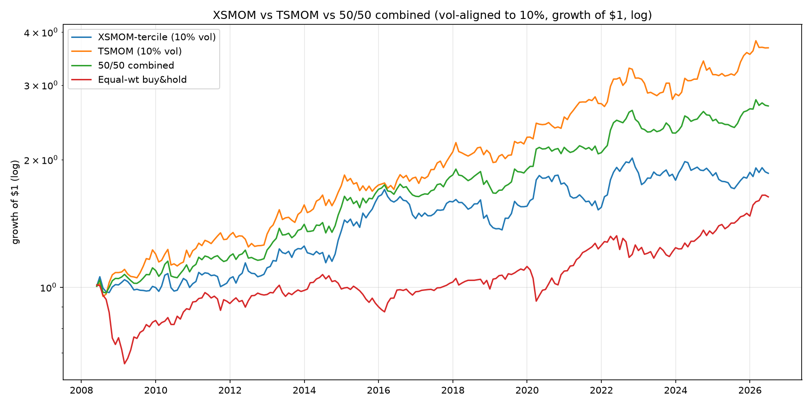

# Cross-Sectional Momentum (XSMOM) — a head-to-head with TSMOM

**A falsification-oriented study of cross-sectional ("relative-strength") momentum on
the *same* 17-ETF universe as this repo's TSMOM, reusing the *same* engine — built to
answer one question honestly: does ranking assets against each other add anything that
trend-following on each asset alone does not?** The deliverable is not a standalone
Sharpe; it is the **comparison** — Sharpe, crisis behaviour, and above all the
**correlation** of the two return streams (the diversification question).

> Companion to [`README.md`](../../README.md) (TSMOM). Same universe, same 12-1 cadence, same
> engine, same no-look-ahead discipline. Only three layers are new — signal,
> dollar-neutral construction, and comparison — in [`src/xsmom.py`](../../src/xsmom.py),
> [`xsmom_config.py`](../../xsmom_config.py), [`run_xsmom.py`](../../run_xsmom.py). **No engine code
> was modified.** Full results: [`XSMOM_REPORT.md`](XSMOM_REPORT.md).

## TL;DR

**The pre-registered verdict: ❌ NOT CONFIRMED — a clean falsification.**

- **XSMOM-tercile net Sharpe = 0.28**, 95% bootstrap CI **[−0.18, 0.75]** → **crosses 0**.
  The headline criterion (CI excludes 0) is **not** met. Rank-weight is the same story
  (0.30, CI [−0.16, 0.77]).
- **The punchline — `corr(XSMOM, TSMOM) = +0.42`** (moderate, positive). Combined with
  XSMOM's much weaker standalone edge, the equal-risk 50/50 mix (Sharpe **0.66**)
  **dilutes** rather than diversifies — it *underperforms* TSMOM alone (0.75). At ETF
  granularity, cross-sectional and time-series momentum substantially overlap.
- **The edge is partly static premium, not dynamic momentum.** Demean each asset's own
  long-run signal and the Sharpe collapses 0.30 → 0.14 (ann. return 3.3% → 0.9%); the
  within-class control also fails the CI test. A chunk of the modest positive was the
  equity-over-bond risk premium disguised as momentum.
- **But the tails are genuinely different-shaped** (the one positive finding): XSMOM
  *gained* +32.7% in the 2008 GFC but *lost* −24.9% in the spring-2009 momentum crash,
  where TSMOM was only −4.5%. Different mechanisms — just not different enough, or
  reliable enough, to pay off.

**Honest conclusion:** on this 17-ETF universe, cross-sectional momentum has **no
statistically confirmable edge**, is **moderately correlated** with the (confirmed)
TSMOM, **adds no diversification**, and what little it has is **partly a static risk
premium**. A textbook negative result — pre-registered and reported as-is.

## How this fits the research arc

Third strategy, **one honest validation methodology** — used to reject and confirm alike:

- **SMC / breakout on XAUUSD** — *falsified* (single-instrument Sharpe CI crossed 0).
- **Multi-asset TSMOM** (this repo, [`README.md`](../../README.md)) — *confirmed* a modest,
  cost-capped edge with real crisis alpha.
- **XSMOM** (this study) — *falsified on the same universe*, **and** shown to add no
  diversification to TSMOM. The interesting negative: at ETF granularity, "rank-relative"
  and "trend-absolute" momentum are largely the *same source*.

## Pre-registered criteria (fixed before looking at any result)

- **CONFIRMED iff** bootstrap Sharpe CI excludes 0 **AND** walk-forward OOS expectancy
  positive **AND** the 3/6/9/12-month formation neighbourhood is the same sign.
- **FALSIFIED if** the CI includes 0 **OR** walk-forward is negative — still documented.
- **All three correlation outcomes pre-accepted:** low → diversification payoff; high →
  "same source at ETF granularity" (honest negative); whoever wins Sharpe/crisis reported
  as-is.
- **Confound:** edge survives within-class / demeaned ranking → real momentum; vanishes →
  static premium. Both honest.

*Result against the criteria: CI crosses 0 → **not confirmed**. (Walk-forward passed 4/5
blocks and 3/6/9/12 were the same sign, but the headline CI test is decisive.)*

## What XSMOM is (and how it differs from TSMOM)

- **Signal — 12-1 with an explicit skip-month:**
  `signal_{i,t} = P_{i,t-21} / P_{i,t-252} − 1` — the return from ~12 months ago to ~1
  month ago, **skipping the most recent 21 trading days** (filters 1-month reversal /
  bid-ask bounce). The skip is explicit and unit-tested (a last-month spike is excluded).
- **Cross-sectional rank → dollar-neutral long-short**, two constructions:
  - **Tercile (headline):** long the top 6 names (+1/6 each), short the bottom 6 (−1/6),
    middle 5 flat.
  - **Rank-weight (robustness):** Lo-MacKinlay `raw_i = rank_i − mean_rank`, each side
    normalised to unit gross.
  - Both **dollar-neutral by construction** (`Σ wₗₒₙ𝓰 = +1`, `Σ wₛₕₒᵣₜ = −1`), **no
    intra-leg vol weighting** (deliberate — vol-tilting would push weight into low-vol
    bonds and stack with the static-premium confound).
- **Risk alignment (portfolio level only):** an ex-ante 10%-vol overlay using **the
  engine's volatility estimator, verbatim** (`portfolio.realized_portfolio_vol`) — applied
  **only** for the equity-curve overlay and the 50/50 combination. Sharpe, correlation and
  all tests run on **natural-scale** returns (they are scale-free).
- vs **TSMOM** = *time-series* momentum: each asset judged against its own past
  (sign of its trailing return), sized by inverse-vol, book can be net long/short and earns
  crisis alpha by going short. XSMOM is ≈0-beta by construction and has **no** directional
  crisis-alpha mechanism — so it loses to a bull-market buy-&-hold *by design* (B&H is a
  background row, never the benchmark).

**Anti-overfitting:** 12-1, terciles, the skip-month and the 10% target are academic
conventions fixed in [`xsmom_config.py`](../../xsmom_config.py), **never tuned**. Tellingly, the
locked 12-1 is the *weakest* of the 3/6/9/12 neighbourhood (0.28 vs 9-1's 0.51) — we did
not pick the best.

## Key results (net of 2 bps, common window **2008-05 → 2026-06**, 218 months)

| | ann return | ann vol | Sharpe | max DD | turnover/yr |
| --- | --- | --- | --- | --- | --- |
| XSMOM-tercile (natural L/S) | 3.3% | 16.7% | **0.28**  *(CI [−0.18, 0.75])* | −32.4% | 8.4× |
| XSMOM-rank (natural L/S) | 3.8% | 17.8% | 0.30  *(CI [−0.16, 0.77])* | −37.6% | 9.0× |
| **TSMOM** (published, 10% vol) | 7.4% | 10.3% | **0.75** | −15.6% | 17.6× |
| Equal-wt buy & hold | 2.7% | 9.7% | 0.33 | −34.8% | — |

*Sharpe is scale-free, so the comparison is fair even though XSMOM (natural, gross 2) and
TSMOM (vol-targeted to 10%) sit at different gross. Gross Sharpe 0.29 ≈ net 0.28 — the weak
result is genuine signal, **not** a cost artefact.*

**Correlation — the headline:** `corr(XSMOM, TSMOM) = +0.42` (rank-weight +0.40); the two
XSMOM constructions agree at +0.98.

**Combined 50/50 (each vol-aligned to 10%):** legs 0.38 / 0.75, ρ = +0.48, combined
**0.66** — matches the closed form `(S₁+S₂)/√(2(1+ρ)) = 0.66`. **Below** TSMOM alone (0.75):
no diversification payoff.



**Crisis windows — different-shaped tails (the one positive finding):**

| window | XSMOM cum | TSMOM cum | buy & hold |
| --- | --- | --- | --- |
| GFC 2008 | **+32.7%** | +11.6% | −27.4% |
| **Mom-crash spring 2009** | **−24.9%** | −4.5% | +14.8% |
| COVID 2020 | +17.3% | +7.3% | −13.0% |
| Calm 2012-2019 | +33.7% | +70.3% | +22.3% |

> XSMOM's risk is a **momentum crash** — the violent rebound of beaten-down losers blowing
> up the short leg (spring 2009: −24.9% while TSMOM lost only −4.5%). TSMOM's risk is
> *directional*. Different mechanisms — the physical reason the correlation isn't higher.

**Confound — momentum or static premium?**

| spec (rank-weight basis) | Sharpe | 95% CI | vs 0 |
| --- | --- | --- | --- |
| rank baseline | 0.30 | [−0.16, 0.77] | crosses 0 |
| within-class ranking | 0.32 | [−0.13, 0.78] | crosses 0 |
| demeaned signal | **0.14** | [−0.32, 0.60] | crosses 0 |

> Demeaning each asset's own long-run signal (the look-ahead-free expanding mean) halves
> the Sharpe and cuts the annual return to 0.9% — a meaningful part of the modest positive
> was **static cross-asset risk premium** (long equities / short bonds), not dynamic
> relative strength.

## How to run

```powershell
.\.venv\Scripts\Activate.ps1
python run_backtest.py     # TSMOM (the baseline this study compares against)
python run_xsmom.py        # XSMOM build + full head-to-head -> output/XSMOM_REPORT.md
python -m pytest -q        # 55 tests (43 engine + 12 new XSMOM no-look-ahead/correctness)
```

Reads the cached daily ETF data (`data/`); regenerates the report, CSVs and the
vol-aligned equity-curve figure in `output/`.

## Engineering notes

- **Reuse, not reinvention.** TSMOM is the published `run_backtest.py` result, unchanged.
  Returns/costs (`performance.portfolio_returns`), the vol estimator
  (`portfolio.realized_portfolio_vol`), and validation (`validation.bootstrap_ci`,
  `subperiod_performance`, `regime_performance`) are all called verbatim.
- **No look-ahead, proven by tests.** The 12-1 signal is two backward `shift`s on closed
  prices; positions are the prior month-end's decision (`shift(1)`); the demean uses an
  *expanding* (backward-only) mean. Truncation-invariance, skip-month, dollar-neutrality and
  position-timing are all unit-tested in [`tests/test_xsmom.py`](../../tests/test_xsmom.py).
- **Honesty rails:** full-universe-only evaluation window (same as TSMOM), gross **and** net
  reported, costs disclosed, deterministic seeds, every parameter in config.

---

*Research and education only. Not investment advice. Backtested performance does not
guarantee future results. © 2026 Aaron Lau Chiong Wen — MIT License.*
