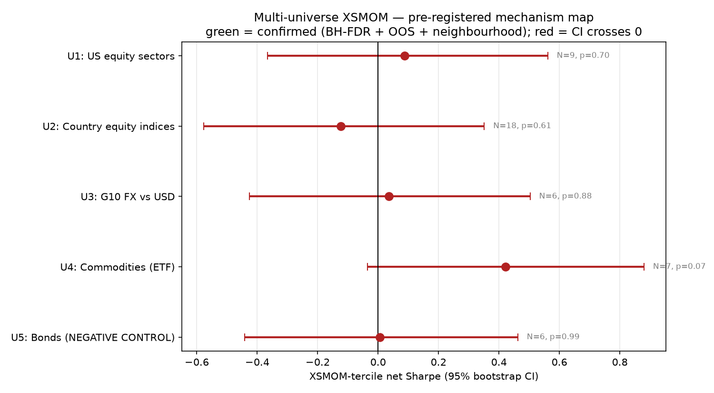

# Multi-Universe XSMOM — FDR-controlled mechanism map

*Generated 2026-06-22 13:35. Five SEALED universes, headline = 12-1 tercile, common window from 2008-05. Pre-registration in `XSMOM_UNIVERSES_README.md` was sealed before these results.*

## TL;DR

- **CONFIRMED universes: 0 / 5** (BH-FDR at α=0.05 — no universe rejected (no p below the BH line); confirmed also requires walk-forward positive **and** 3/6/9/12 same sign).
- **Best universe = U4 (Commodities (ETF))**, net Sharpe 0.42; **Deflated Sharpe (5 trials) = 0.779** (benchmark SR\* = 0.070/mo, PSR vs 0 = 0.965).
- **Authoritative conclusion:** at liquid-ETF granularity, XSMOM's edge is **marginal / arbitraged even inside its theoretical domain** — no universe survives the family-corrected test. Statistically this is *failed-to-reject* (not *proven absent*); the power-independent leg is that term2 (lead-lag) is **not shown to be non-trivial anywhere** (see Methods). Reported as the headline result, not a failure.

## The map

| universe | N | net Sharpe | 95% CI | p | q(BH) | WF OOS | 3·6·9·12 | confirmed? | corr vs TSMOM | combo vs best leg | cost ceil |
| --- | --- | --- | --- | --- | --- | --- | --- | --- | --- | --- | --- |
| **U1** US equity sectors | 9 | +0.09 | [-0.37, +0.56] | 0.697 | 0.988 | 4/5✓ | ✗ | ❌ | +0.12 | 0.41 vs 0.34 | 15bp |
| **U2** Country equity indices | 18 | -0.12 | [-0.58, +0.35] | 0.614 | 0.988 | 3/5✗ | ✓ | ❌ | +0.14 | 0.03 vs 0.11 | 0bp |
| **U3** G10 FX vs USD | 6 | +0.04 | [-0.43, +0.50] | 0.878 | 0.988 | 3/5✓ | ✗ | ❌ | +0.23 | -0.00 vs 0.07 | 5bp |
| **U4** Commodities (ETF) | 7 | +0.42 | [-0.04, +0.88] | 0.071 | 0.357 | 4/5✓ | ✓ | ❌ | +0.31 | 0.56 vs 0.46 | 150bp |
| **U5** Bonds (NEGATIVE CONTROL) | 6 | +0.01 | [-0.44, +0.46] | 0.988 | 0.988 | 3/5✓ | ✓ | ❌ | +0.25 | 0.52 vs 0.64 | 3bp |

> `WF OOS` = walk-forward 4-yr non-overlapping blocks positive (✓=majority). `3·6·9·12` = formation-neighbourhood sign consistency. **All three** are the pre-registered confirmed criteria; `confirmed?` = BH-reject **and** WF✓ **and** sign✓. `cost ceil` = one-way bps at which mean net return → 0; `combo vs best leg` = 50/50 vol-aligned combined Sharpe vs the stronger standalone leg.

**Deflated-Sharpe audit (A1):** best universe = U4; **trials = 5** (the five sealed 12-1 tercile tests only — the 3/6/9/12 neighbourhood and rank-weight are robustness, excluded). Expected-max-under-null benchmark **SR\* = 0.070/mo** (Bailey–LdP order statistic on the cross-trial Sharpe dispersion). PSR vs 0 = 0.965; **DSR = 0.779** (< 0.95 ⇒ even the best of five is not significant after selection).

## Methods & honest scope

**Statistical conclusion = *failed to reject*, not *proved no edge*.** Every universe's Sharpe-vs-0 CI contains 0, so we fail to reject H0 at the available power — and the power is genuinely limited: thin cross-sections (N as small as **6**; tercile legs of 2 names at U3/U4/U5), **~218 months**, and bootstrap Sharpe CIs ≈ **±0.45**. The FX/commodity ETFs only list from ~2006, so even the secondary native-window robustness cannot extend them much. We therefore claim *"no detectable edge at this power"*, **not** *"edge proven absent."*

**Mechanism conclusion = the power-independent finding.** For XSMOM to beat TSMOM, the lead-lag term (term2) had to be non-trivial. In **no** universe is term2 statistically distinguishable from 0 (every block-bootstrap CI contains 0) — a statement about the lead-lag channel itself, independent of the Sharpe-test power. **But** term2 is *imprecisely* estimated (its CI admits magnitudes ≥ |term1| in every universe; widest at N=18), so the honest reading is **"term2 not shown to be non-trivial"**, not "term2 ≈ 0." The only reliably-present term is term1 (own-autocorrelation) — which TSMOM already harvests. On the combined weight of the all-negative Sharpe map, the demean collapse, and the absent (undemonstrated) lead-lag, XSMOM behaves as a market-neutral echo of the same source; we state that as *not demonstrated otherwise*, not as a proof of zero.

## Mechanism decomposition (Lo–MacKinlay, lag-1 monthly)

Annualised profit contributions (×12, in bps of the WRSS momentum book); term2 enters the profit with a **minus** (`E[π]=term1−term2+term3`). term1 = own-autocorrelation (shared with TSMOM); **term2 = lead-lag (XSMOM-only — must be non-trivial to beat TSMOM)**; term3 = cross-sectional dispersion of means (static-premium suspect).

| universe | term1 own-autocov | term2 lead-lag | term3 dispersion | term2 vs 0 (precision) | demean test |
| --- | --- | --- | --- | --- | --- |
| U1 | -5 [-53, +37] | -8 [-49, +32] | +1 [+0, +3] | contains 0; imprecise (CI≈9.8×|t1|) | collapses |
| U2 | +17 [-52, +72] | +22 [-43, +78] | +1 [+0, +2] | contains 0; imprecise (CI≈4.6×|t1|) | collapses |
| U3 | -2 [-10, +3] | -1 [-7, +3] | +0 [+0, +1] | contains 0; imprecise (CI≈3.1×|t1|) | collapses |
| U4 | +50 [-29, +100] | +25 [-25, +52] | +9 [+1, +31] | contains 0; imprecise (CI≈1.0×|t1|) | collapses |
| U5 | +1 [-5, +5] | -0 [-4, +3] | +0 [+0, +1] | contains 0; imprecise (CI≈2.5×|t1|) | collapses |

> **A2 — term2 zero-overlap:** **5/5** universes have a term2 CI that contains 0 (the XSMOM-only lead-lag channel is not distinguishable from zero in any of them).
> **C1 — precision fork:** **0/5** universes are *confidently small* (term2 CI bounded below |term1|); the rest are **imprecise** — the term2 CI admits magnitudes ≥ |term1| (e.g. U4 term2 CI rivals term1; U2 is very wide at N=18). So the honest claim is **"term2 not shown to be non-trivial"**, NOT "term2 proven ≈ 0". `E[π]=term1−term2+term3`; the block length is 12 months (justified in `src/xsmom_stats.py`).
> term3 is cross-validated by the demean test: large term3 **and** Sharpe collapse under demeaning ⟹ the dispersion was static premium.

## U1 — US equity sectors  *(prior: strong)*

*Homogeneity argument:* All large-cap US equity → share the US market factor → ranking nets out market beta → residual is pure sector-rotation dispersion (textbook XSMOM domain, Moskowitz-Grinblatt 1999).

- N=9 (tercile 3/3); months=218 (2008-05-31→2026-06-30).
- **XSMOM-tercile** net Sharpe **+0.09** (ann 0.3%, vol 13.9%, maxDD -38.7%, turnover 9.7×); rank-weight +0.01.
- vs 0: 95% CI [-0.37, +0.56], p=0.697, q(BH)=0.988 → **CI/BH includes 0**. Walk-forward 4/5 blocks positive (pass); 3/6/9/12 same sign: False (3m:-0.29, 6m:-0.22, 9m:-0.14, 12m:+0.09).
- **TSMOM on this universe** Sharpe +0.34; **corr(XSMOM,TSMOM)=+0.12**. Combo 50/50 @10% = 0.41 (legs 0.26/0.34, ρ=+0.11); break-even ρ\*=+0.60 → combo **beats** best leg.

  Crisis windows (cum return) — XSMOM vs TSMOM:

| window | XSMOM | TSMOM |
| --- | --- | --- |
| GFC 2008 | 17.0% | 8.8% |
| Mom-crash 2009 | -25.1% | -6.2% |
| COVID 2020 | 4.7% | -1.5% |
| Calm 2012-2019 | -17.3% | 75.0% |

- Confound: rank baseline: +0.01 (crosses 0); demeaned: +0.08 (crosses 0). Cost ceiling ≈ 15 bps one-way.
- **Verdict: ❌ falsified** under the pre-registered criteria.

## U2 — Country equity indices  *(prior: strong)*

*Homogeneity argument:* All single-country equity → share the global equity factor → ranking nets it out → residual is country momentum (Asness-Liew-Stevens 1997). Large N.

- N=18 (tercile 6/6); months=218 (2008-05-31→2026-06-30).
- **XSMOM-tercile** net Sharpe **-0.12** (ann -1.7%, vol 9.8%, maxDD -50.5%, turnover 10.7×); rank-weight -0.14.
- vs 0: 95% CI [-0.58, +0.35], p=0.614, q(BH)=0.988 → **CI/BH includes 0**. Walk-forward 3/5 blocks positive (fail); 3/6/9/12 same sign: True (3m:-0.00, 6m:-0.04, 9m:-0.09, 12m:-0.12).
- **TSMOM on this universe** Sharpe +0.11; **corr(XSMOM,TSMOM)=+0.14**. Combo 50/50 @10% = 0.03 (legs -0.08/0.11, ρ=+0.14); break-even ρ\*=-0.96 → combo **does not beat** best leg.

  Crisis windows (cum return) — XSMOM vs TSMOM:

| window | XSMOM | TSMOM |
| --- | --- | --- |
| GFC 2008 | -14.0% | 10.0% |
| Mom-crash 2009 | -14.9% | -5.1% |
| COVID 2020 | 3.2% | 4.5% |
| Calm 2012-2019 | -29.8% | -11.1% |

- Confound: rank baseline: -0.14 (crosses 0); demeaned: +0.03 (crosses 0). Cost ceiling ≈ 0 bps one-way.
- **Verdict: ❌ falsified** under the pre-registered criteria.

## U3 — G10 FX vs USD  *(prior: weak)*

*Homogeneity argument:* All majors quoted vs USD → share the USD factor → ranking nets it out → residual is currency cross-momentum. Small N → thin legs; FX momentum weak.

- N=6 (tercile 2/2); months=218 (2008-05-31→2026-06-30).
- **XSMOM-tercile** net Sharpe **+0.04** (ann -0.0%, vol 7.4%, maxDD -26.8%, turnover 10.3×); rank-weight +0.03.
- vs 0: 95% CI [-0.43, +0.50], p=0.878, q(BH)=0.988 → **CI/BH includes 0**. Walk-forward 3/5 blocks positive (pass); 3/6/9/12 same sign: False (3m:+0.07, 6m:-0.09, 9m:-0.03, 12m:+0.04).
- **TSMOM on this universe** Sharpe -0.07; **corr(XSMOM,TSMOM)=+0.23**. Combo 50/50 @10% = -0.00 (legs 0.07/-0.07, ρ=+0.27); break-even ρ\*=-1.00 → combo **does not beat** best leg.

  Crisis windows (cum return) — XSMOM vs TSMOM:

| window | XSMOM | TSMOM |
| --- | --- | --- |
| GFC 2008 | 2.2% | 8.7% |
| Mom-crash 2009 | -14.3% | -2.3% |
| COVID 2020 | -0.0% | 8.6% |
| Calm 2012-2019 | -12.6% | -24.4% |

- Confound: rank baseline: +0.03 (crosses 0); demeaned: +0.02 (crosses 0). Cost ceiling ≈ 5 bps one-way.
- **Verdict: ❌ falsified** under the pre-registered criteria.

## U4 — Commodities (ETF)  *(prior: weak/caveated)*

*Homogeneity argument:* Loosely 'all commodities' but heterogeneous drivers; commodity ETFs suffer roll/contango decay and are NOT clean futures proxies — itself a confound.

- N=7 (tercile 2/2); months=218 (2008-05-31→2026-06-30).
- **XSMOM-tercile** net Sharpe **+0.42** (ann 8.9%, vol 33.1%, maxDD -59.7%, turnover 9.4×); rank-weight +0.31.
- vs 0: 95% CI [-0.04, +0.88], p=0.071, q(BH)=0.357 → **CI/BH includes 0**. Walk-forward 4/5 blocks positive (pass); 3/6/9/12 same sign: True (3m:+0.23, 6m:+0.07, 9m:+0.20, 12m:+0.42).
- **TSMOM on this universe** Sharpe +0.46; **corr(XSMOM,TSMOM)=+0.31**. Combo 50/50 @10% = 0.56 (legs 0.46/0.46, ρ=+0.35); break-even ρ\*=+0.99 → combo **beats** best leg.

  Crisis windows (cum return) — XSMOM vs TSMOM:

| window | XSMOM | TSMOM |
| --- | --- | --- |
| GFC 2008 | 2.2% | 11.3% |
| Mom-crash 2009 | -3.6% | -6.0% |
| COVID 2020 | 22.8% | 20.8% |
| Calm 2012-2019 | 6.5% | 11.1% |

- Confound: rank baseline: +0.31 (crosses 0); demeaned: -0.07 (crosses 0); within-class: +0.16 (crosses 0). Cost ceiling ≈ 150 bps one-way.
- **Verdict: ❌ falsified** under the pre-registered criteria.

## U5 — Bonds (NEGATIVE CONTROL)  *(prior: predicted negative)*

*Homogeneity argument:* Duration and credit are different betas → ranking sorts on static term/credit premia, not dynamic momentum. Predicted to look weakly positive raw and collapse hardest under demeaning — a negative that validates the confound theory.

*Coverage drops:* EMB (inception 2007-12-19 > 2007-05-01 (no 2008 coverage))

- N=6 (tercile 2/2); months=217 (2008-05-31→2026-06-30).
- **XSMOM-tercile** net Sharpe **+0.01** (ann -0.4%, vol 9.9%, maxDD -45.4%, turnover 9.5×); rank-weight +0.01.
- vs 0: 95% CI [-0.44, +0.46], p=0.988, q(BH)=0.988 → **CI/BH includes 0**. Walk-forward 3/5 blocks positive (pass); 3/6/9/12 same sign: True (3m:+0.14, 6m:+0.12, 9m:+0.16, 12m:+0.01).
- **TSMOM on this universe** Sharpe +0.64; **corr(XSMOM,TSMOM)=+0.25**. Combo 50/50 @10% = 0.52 (legs 0.23/0.64, ρ=+0.26); break-even ρ\*=-0.07 → combo **does not beat** best leg.

  Crisis windows (cum return) — XSMOM vs TSMOM:

| window | XSMOM | TSMOM |
| --- | --- | --- |
| GFC 2008 | 6.6% | 4.4% |
| Mom-crash 2009 | -20.6% | -2.0% |
| COVID 2020 | 8.0% | 0.3% |
| Calm 2012-2019 | 14.5% | 36.6% |

- Confound: rank baseline: +0.01 (crosses 0); demeaned: +0.02 (crosses 0); within-class: -0.00 (crosses 0). Cost ceiling ≈ 3 bps one-way.
- **Verdict: ❌ falsified** under the pre-registered criteria.

## Cross-universe XSMOM correlation (are these the same bet?)

|  | U1 | U2 | U3 | U4 | U5 |
| --- | --- | --- | --- | --- | --- |
| U1 | +1.00 | +0.26 | +0.27 | +0.03 | +0.36 |
| U2 | +0.26 | +1.00 | +0.28 | +0.03 | +0.22 |
| U3 | +0.27 | +0.28 | +1.00 | +0.15 | +0.26 |
| U4 | +0.03 | +0.03 | +0.15 | +1.00 | +0.09 |
| U5 | +0.36 | +0.22 | +0.26 | +0.09 | +1.00 |

---
*Reuses the TSMOM engine + Phase-1 `src/xsmom.py` verbatim; new logic = universe loop, BH-FDR / Deflated-Sharpe (`src/xsmom_stats.py`), Lo-MacKinlay decomposition. No engine code modified; all prior tests still pass. Research/education only — not investment advice.*